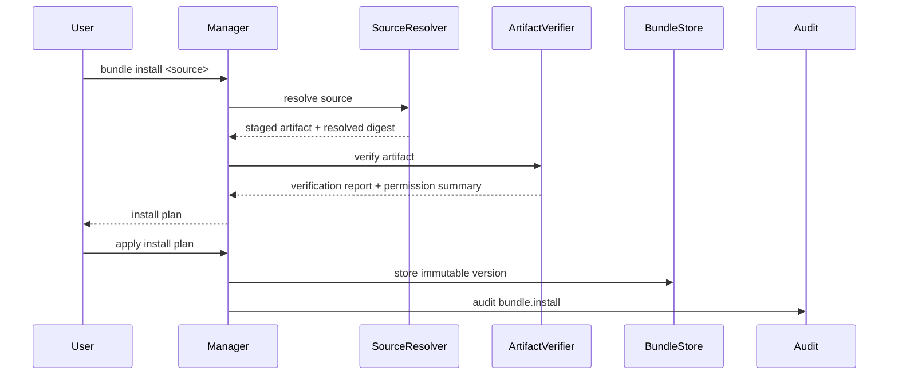
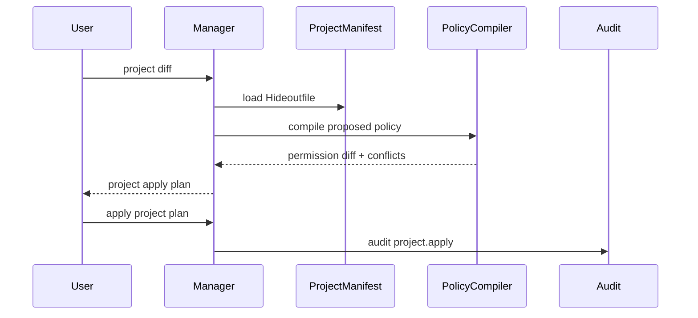
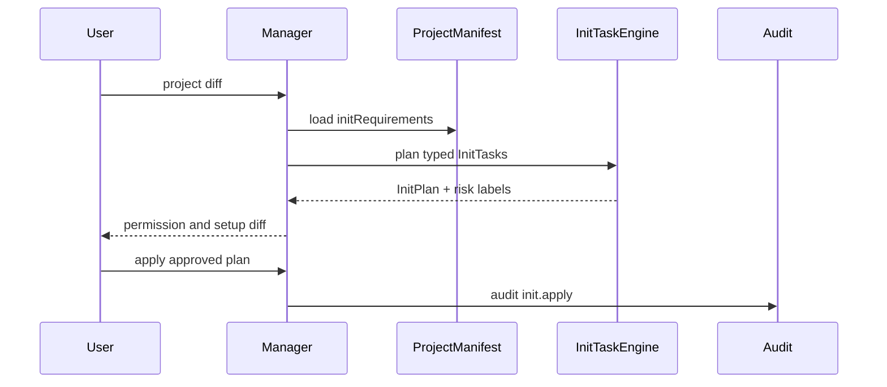
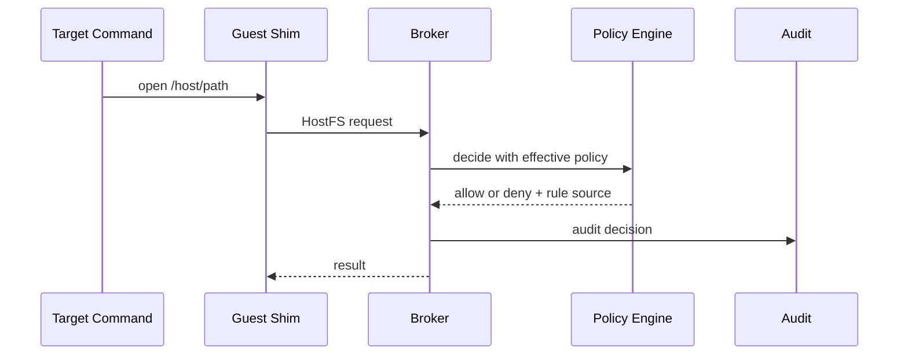

# Ecosystem Foundation Design

<!-- markdownlint-disable MD013 -->

## Contract

This document defines the bottom-layer architecture needed before Hideout grows
a public ecosystem of bundles, project manifests, presets, scripts, and
community recipes.

It follows the constitutional and runtime contracts:

- [architecture-principles.md](architecture-principles.md)
- [init-task-architecture.md](init-task-architecture.md)
- [manager-control-plane.md](manager-control-plane.md)

[policy-config-supply-chain.md](policy-config-supply-chain.md) is subordinate
to this document for authoring, sharing, installing, updating, and exporting
those artifacts. It must not redefine the ecosystem resource model, effective
policy composition order, project manifest authority model, or ecosystem phase
plan.

The purpose is to make ecosystem support a stable runtime contract, not a later
UI or marketplace feature. Bundles, Hideoutfile, TUI, WebUI, and future registry
features must compile into the same Manager resources and effective policy
model.

This document is the canonical source for ecosystem resource names, policy
composition, project manifest authority, and ecosystem delivery sequence. It
does not own supply-chain UX details such as source syntax, update commands,
trust labels, export CLI shape, or registry operations; those belong to
[policy-config-supply-chain.md](policy-config-supply-chain.md) and must compile
back into the model defined here.

## Design Goal

Hideout should support a community ecosystem without allowing community
artifacts to become hidden authority.

The bottom layer must support:

- local and Git-installed bundles;
- project manifests that are safe to commit;
- permission review before authority changes;
- schema validation and compatibility checks;
- lock files and reproducible installs;
- constrained goja scripts;
- install, update, rollback, and audit;
- future TUI/WebUI views without duplicating policy logic.

The user-facing ecosystem can evolve later. The architecture cannot rely on a
future marketplace to enforce privacy boundaries.

The scope is a professional individual operator on their own machine.
Ecosystem machinery in this document serves that prosumer operator installing
artifacts from Git; organization-scale distribution, approval workflows, and
policy servers are out of scope.

## Non-Negotiable Ecosystem Principles

### 1. Artifacts Declare, Manager Applies

Ecosystem artifacts are declarations. They do not directly mutate runtime
authority.

```text
Bundle / Hideoutfile / Recipe / Template
        |
        | parse, validate, verify
        v
InstallPlan / ProjectPlan / PermissionDiff
        |
        | explicit apply
        v
Manager resources
        |
        v
Effective policy
```

A bundle install does not by itself change effective policy. A project
manifest discovery is not a profile mutation. A script package is not an
arbitrary plugin.

### 2. Install Never Takes Effect Silently

Installing a bundle places a verified artifact into the local bundle store.
Taking effect requires an explicit confirmed step, presented inside the same
single review-and-confirm install flow: the install plan shows the permission
diff, the user confirms, and only then does the bundle reference participate
in effective policy for the selected profile or project scope. An unconfirmed
install leaves a stored artifact with no policy effect.

This keeps update and rollback understandable:

```text
installed bundle version
  may be inspected, verified, updated, or removed

confirmed bundle reference
  participates in effective policy composition
```

### 3. Project Manifests Are Git-Safe

`Hideoutfile` is a project-level suggestion and constraint file. It is not a
profile dump and must not contain local identity state.

Allowed:

- bundle references;
- required Hideout capability versions;
- workspace-relative policy suggestions;
- template input declarations;
- project-specific denied paths inside the workspace;
- network or OpenTarget recommendations.

Disallowed by default:

- profile identity material;
- local absolute host paths, except explicit examples;
- real proxy URLs with credentials;
- secret values;
- session state;
- audit history;
- HostFS overlay contents.

### 4. Permissions Are Typed And Reviewable

Every bundle permission must map to a known subsystem and action shape.

Examples:

```text
command.decide
audit.redact
hostfs.template
opentarget.template
network.recommend
doctor.check
project.requirement
init.requirement
command.expected.check
```

`doctor.check` is a declarative permission: it contributes check definitions
consumed as data by the doctor engine. It is not a goja entrypoint.

Disallowed:

```text
host.exec
host.shell
hostfs.raw_mount
network.raw_route
manager.raw_mutation
script.unrestricted
bundle.installScript
project.initScript
```

Permissions are capabilities to propose policy. They are not direct runtime
grants unless a Manager plan explicitly enables them.

### 5. Scripts Are Extension Points, Not Packages

Goja scripts inside bundles can only run through registered entrypoints.

The script runtime must provide:

- fixed input schema per entrypoint;
- fixed output schema per entrypoint;
- timeout and interrupt support;
- panic recovery;
- no filesystem, network, process, timer, or module APIs beyond the
  constrained context/query API defined in
  [script-extension-architecture.md](script-extension-architecture.md);
- no mutable global state shared across users or profiles;
- validator-owned final decisions.

Scripts may propose decisions. Builtin Go validators and subsystem policies
remain the authority.

### 6. Adapters Are Composition Units, Not Authority

Bundles may ship JavaScript adapters for domain workflows.

An adapter maps product intent into Hideout capability proposals. Examples:

- preview adapter for H5 dev servers;
- browser-control adapter for an isolated browser profile;
- adb adapter for controlled access to a host adb server endpoint;
- simulator adapter for mobile deep links;
- command compatibility adapter for a known tool.

Adapters may use only the constrained script SDK described in
[script-extension-architecture.md](script-extension-architecture.md). They may
classify input, choose templates, construct proposals, add audit tags, and
redact presentation fields. They must not read host state beyond the
constrained context/query API defined in
[script-extension-architecture.md](script-extension-architecture.md), and
must not open network connections, spawn processes, mutate profiles, allocate
ports, or execute capabilities.

Persona recipes compose adapters with policy templates, environment hints,
doctor checks, and sensitive-path deny templates. They are the community-facing
unit for H5, Android, iOS-assisted, backend, and AI-agent workflows.

### 7. Runtime Evidence Cannot Be Deleted By Ecosystem Code

Bundles may provide audit redaction rules for export or presentation. They must
not remove core runtime evidence from local audit records.

Non-removable evidence includes:

- requested HostFS path;
- decision;
- rule ID;
- rule source;
- command proxy action;
- OpenTarget target type;
- PortBridge lifecycle event;
- network mode and leak check result;
- bundle version that contributed a policy decision.

### 8. Phase 1 Bundles Do Not Ship Executables

Phase 1 bundles may contain:

- JSON manifests;
- schemas;
- goja scripts;
- JavaScript adapters that use registered entrypoints;
- persona recipes;
- docs;
- test fixtures;
- examples.

Phase 1 bundles must not contain:

- executable binaries;
- dynamic libraries;
- shell install scripts;
- backend helper binaries;
- auto-run hooks outside registered goja entrypoints.

This can be revisited only with a new design contract, signature model, and
release gate.

### 9. Init Requirements Are Declarative

Bundles and project manifests may declare initialization requirements, setup
checks, and expected-command declarations. They must not ship executable
initialization scripts.

Allowed:

```text
requires helper hideout-shim-linux-arm64 >= 0.1.0
requires backend capability hostfs.v1
recommends network mode tun2socks
checks guest command git
suggests project Hideoutfile template
```

Disallowed:

```text
run this shell script on first install
run npm install -g
run brew install
run curl | sh
modify profile grants automatically
```

Manager compiles requirements into an InitPlan. The user applies the plan when
it changes authority.

### 10. Guest Base Environment Is Declarative Data

An ecosystem artifact may declare a guest base image reference: an image name
plus digest, nothing more. Backends consume that reference to start the guest.

The dividing line is data consumed versus steps executed. Referencing an
existing image is data. Ecosystem-shared preparation steps that Hideout would
execute — Dockerfile-like RUN, install scripts, first-boot hooks — remain
prohibited until a dedicated trust design.

A bad image degrades to the threats the boundary already contains: hostile
code running inside the guest, the A2/A3 adversary classes in
[threat-model.md](threat-model.md). It gains no host authority, so a declared
image reference does not trigger the host trust gate and does not touch the
host isolation claims.

The image digest participates in the environment fingerprint. Changing the
image reference means a new environment, not a mutation of the existing one.

Backend configuration — mounts, port forwards, network, provisioning
fragments — is host domain and is always generated by Hideout, never injected
by ecosystem artifacts. An image may carry in-guest autostart behavior; that
behavior runs in the guest domain and is contained by the boundary, but
Hideout never executes any host-side hook carried by an image.

## Layered Architecture

```text
Source Resolver
  local dir / tarball / git / github shorthand
        |
        v
Artifact Verifier
  schema / checksum / forbidden file scan / secret scan / compatibility
        |
        v
Bundle Store
  immutable installed versions
        |
        v
Permission Analyzer
  permissions / entrypoints / templates / risk labels
        |
        v
Manager Plan
  install / project apply / init / update / rollback / export
        |
        v
Policy Compiler
  defaults + bundle refs + project + profile overrides + run flags - deny
        |
        v
Effective Policy
  HostFS / Command Proxy / Network / OpenTarget / Audit / Doctor
```

No ecosystem component can bypass the Policy Compiler or Manager plan/apply.

## Core Components

### Source Resolver

Resolves artifact sources into a local staged directory.

Supported early sources:

```text
local directory
tarball
git URL
github:owner/repo/path@ref
```

The trust vocabulary for resolved sources is defined by the Trust Model in
[policy-config-supply-chain.md](policy-config-supply-chain.md#trust-model).

The resolver records:

- source string;
- resolved commit or digest;
- fetch time;
- source type;
- trust hint;
- local staging path.

The resolver must not apply policy.

### Artifact Verifier

Validates a staged artifact before it enters the bundle store.

Required checks:

- manifest schema;
- apiVersion compatibility;
- entrypoint file existence;
- script size limit;
- permission declaration completeness;
- forbidden file scan;
- secret-looking value scan;
- local absolute path scan;
- checksum verification when lock data exists.

The verifier produces a `VerificationReport`, which carries the compatibility
result as a field.

### Bundle Store

Stores immutable bundle versions.

```text
~/.hideout/bundles/<publisher>/<name>/<version>/
```

Rules:

- installed versions are content-addressed or checksum recorded;
- updates install a new version instead of mutating the old one;
- rollback changes confirmed references, not stored content;
- local edits to installed bundle content make verification fail.

### Permission Analyzer

Turns bundle declarations into a permission diff that can be shown by CLI, TUI,
or WebUI.

Permission diff should show:

- new entrypoints;
- changed entrypoints;
- HostFS templates;
- OpenTarget templates;
- network recommendations;
- command proxy hooks;
- audit redaction hooks;
- doctor checks;
- declared inputs;
- risk labels.

### Policy Compiler

Compiles all policy sources into one effective policy.

Order:

```text
Hideout defaults
  + installed bundle defaults referenced by profile or project
  + project Hideoutfile requirements
  + profile local overrides
  + run flags
  - deny rules
  = effective policy
```

Deny rules are subtractive. No bundle can override them.

### Script Runtime

Runs constrained goja entrypoints.

The runtime must be owned by the Policy Engine, not by individual subsystems.
Subsystems ask the Policy Engine for decisions and receive validated results.
SDK classes, delivery phase, and runtime restrictions are defined in
[script-extension-architecture.md](script-extension-architecture.md). The
runtime must not expose raw Go standard library packages or subsystem handles.

### Trust Store

Tracks where installed artifacts came from and what verification was
performed. The trust vocabulary is defined by the Trust Model in
[policy-config-supply-chain.md](policy-config-supply-chain.md#trust-model):
two levels, `local` and `third-party`, recorded as a field of local install
state.

Trust affects warnings and review UX. It does not bypass runtime validation.

## Domain Resources

Manager must model ecosystem state as resources.

```text
BundleSource
Bundle
BundleVersion
BundleInstall
BundleReference
BundleEntrypoint
BundlePermission
Recipe
GuestImageRef
InitRequirement
InitPlan
ProjectManifest
ProjectLock
ProjectApplyPlan
VerificationReport
```

Compatibility results are fields of `VerificationReport`. The trust level is a
field of local install state, not a separate resource.

Each resource needs:

```text
id
kind
apiVersion
status
createdAt
updatedAt
ownerProfile, when relevant
ownerProject, when relevant
sourceRef, when relevant
checksum, when relevant
capabilityBoundary, when relevant
```

## Bundle Manifest Contract

Bundle is the publishable artifact unit. A bundle may contain configuration,
schemas, goja scripts, JavaScript adapters, persona recipes, docs, examples, and
test fixtures. It must not contain executable binaries, shell install scripts,
backend helper binaries, or auto-run hooks outside registered goja entrypoints.

Preferred manifest shape:

```json
{
  "apiVersion": "hideout.bundle/v1",
  "kind": "PolicyBundle",
  "name": "web-agent-safe",
  "version": "1.0.0",
  "publisher": "hideout-community",
  "description": "Safe defaults for web development agents",
  "compatibility": {
    "hideout": ">=0.1.0 <0.2.0",
    "profileSchema": "hideout.profile/v1"
  },
  "entrypoints": {
    "command.decide": "policy/command_decide.js",
    "audit.redact": "policy/audit_redact.js"
  },
  "permissions": [
    "command.decide",
    "audit.redact",
    "hostfs.template",
    "opentarget.template"
  ],
  "inputs": {},
  "checksums": {},
  "signature": null
}
```

Recipe is a smaller reusable policy pattern inside a bundle. Persona recipes are
higher-level recipes for developer workflows, such as H5 development,
Android-assisted workflows, iOS-assisted workflows, backend agents, or general
AI-agent workflows. Recipes may compose adapters, policy templates,
environment hints, doctor checks, and sensitive-path deny templates, and may
declare a guest base image reference (see Principle 10).

## Hideoutfile Contract

`Hideoutfile` is the project manifest. It is safe to commit by design.

Preferred shape:

```json
{
  "apiVersion": "hideout.project/v1",
  "kind": "ProjectManifest",
  "requirements": {
    "hideout": ">=0.1.0 <0.2.0",
    "capabilities": [
      "hostfs.v1",
      "opentarget.host_open"
    ]
  },
  "initRequirements": [
    {
      "kind": "backendCapability",
      "id": "hostfs.v1"
    }
  ],
  "bundles": [
    {
      "source": "github:vibe-agi/hideout-bundles/web-agent-safe@1.0.0",
      "name": "web-agent-safe"
    }
  ],
  "environment": {
    "baseImage": {
      "ref": "ghcr.io/vibe-agi/hideout-guest-node:22",
      "digest": "sha256:5b0bcabd1ed22e9fb1310cf6c2dec7cdef19f0ad69efa1f392e94a4333501270"
    }
  },
  "projectPolicy": {
    "network": {
      "mode": "direct",
      "warning": "network identity visible"
    },
    "hostfsTemplates": [
      {
        "bundle": "web-agent-safe",
        "id": "project-docs",
        "inputs": {
          "path": "${workspace}/docs/*.md"
        }
      }
    ]
  }
}
```

Avoid a top-level `profile` field in project manifests. The project can request
policy, but it does not own the user's profile.

A project-declared base image is a suggestion like any other project
declaration: it still flows through the project diff/apply review before it
affects any environment.

## Lock And Local State

Commit-safe project lock:

```text
hideout.lock.json
```

May contain:

- bundle source;
- resolved ref;
- digest;
- compatibility result;
- schema version.

Must not contain:

- install time;
- local cache path;
- user approval history;
- private trust override;
- local profile ID;
- local absolute paths unless part of the committed project.

Local install state belongs under the Hideout store, not the project.

```text
~/.hideout/install-state.json
```

## Sequence: Bundle Install



The install plan presents the permission diff, and the confirmation step is
part of the same install flow. Without that confirmation, the stored bundle
contributes nothing to effective policy.

## Sequence: Project Apply



Project apply can link bundle references and project requirements. It must not
silently write local profile identity or secrets.

## Sequence: Init Requirement



No executable init body is loaded from the project or bundle.

## Sequence: Runtime Policy Use



The bundle that contributed a decision is recorded as rule source. The target
command never talks to bundle scripts directly.

## Export Safety Matrix

`hideout bundle export --from-profile` is a later increment. The matrix below
is the contract it must satisfy when it ships, and it must be conservative.

| Data | Default export | Reason |
| --- | --- | --- |
| Bundle references | allow | Shareable dependency graph |
| Base image reference | allow | Guest-domain data, digest-pinned |
| Command policy templates | allow | Reviewable policy |
| HostFS templates with variables | allow | No local path leak |
| Resolved local HostFS grants | reject | Host path leak |
| Local absolute paths | reject or example-only | Machine identity leak |
| Profile identity | reject | Private identity |
| SecretRef names | redact | May reveal setup |
| Secret values | reject | Credential leak |
| Audit logs | reject unless sanitized | Behavior leak |
| HostFS overlay contents | reject | Host file content leak |
| Usage-derived allow/deny | reject by default | Private behavior |

Export must produce a report describing rejected and redacted fields.

## Failure Behavior

Ecosystem operations fail closed when:

- schema is unknown;
- compatibility is outside supported range;
- permission is undeclared;
- init requirement contains an executable body;
- entrypoint file is missing;
- script exceeds limits;
- forbidden file type is present;
- lock checksum mismatches;
- project manifest attempts to mutate profile identity;
- a bundle asks for unsupported raw host authority.

Warnings are acceptable for trust level, not for missing privacy contracts.

## Release Gates

Ecosystem foundation needs tests before public bundle usage:

- schema validation for bundle and project manifests;
- forbidden file and secret scan fixtures;
- install review-and-confirm flow: an unconfirmed install contributes nothing
  to effective policy;
- lock checksum mismatch fail-closed;
- project manifest cannot mutate profile identity;
- export redaction matrix tests;
- permission diff contains every subsystem boundary change;
- scripts cannot access filesystem, network, process, timers, or modules;
- bundle and project init requirements compile into typed InitTasks, not
  scripts;
- effective policy records bundle source in audit decisions.

## Ecosystem Delivery Sequence

This is the authoritative sequence for ecosystem delivery. It is not a current
implementation status table; [STATUS.md](STATUS.md) owns current product
status. Supply-chain documents may add operational checklists, but they must
not introduce a second ecosystem roadmap.

### Phase 1 Foundation

- document ecosystem resource model;
- define bundle and Hideoutfile schemas;
- keep bundles config/script/docs/tests only;
- keep install a single review-and-confirm flow that never takes effect
  silently;
- keep init requirements declarative;
- route all ecosystem state through Manager resources;
- define export safety matrix.

### First Product Increment

- `hideout bundle install/list/verify/remove` with the single review-and-confirm
  install flow; no separate enable command;
- local and Git source resolver;
- bundle store;
- project diff/apply;
- permission review output;
- lock file;
- basic TUI bundle/status views.

### Later

- signed bundles;
- official registry;
- marketplace;
- binary extension model, only after a separate security design;
- imperative environment recipe artifacts: a declarative guest base image
  reference is already an allowed guest-domain artifact field (Principle 10);
  what stays gated is the imperative class — ecosystem-shared preparation
  steps that Hideout would execute (Dockerfile-like RUN, install scripts,
  first-boot hooks) — which needs a dedicated trust design covering source
  identity, review, pinning, and setup-phase evidence. Until then, imperative
  setup stays operator-authored and runs as ordinary in-boundary target
  execution.
