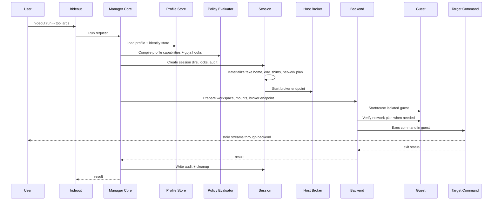
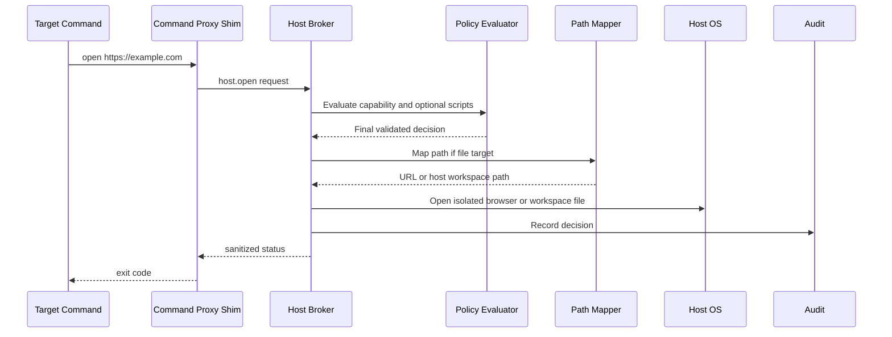
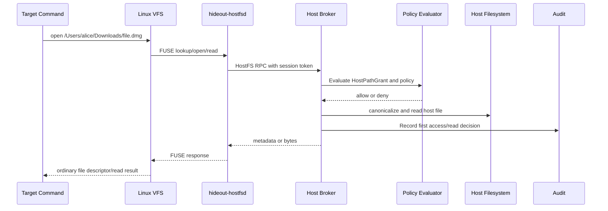
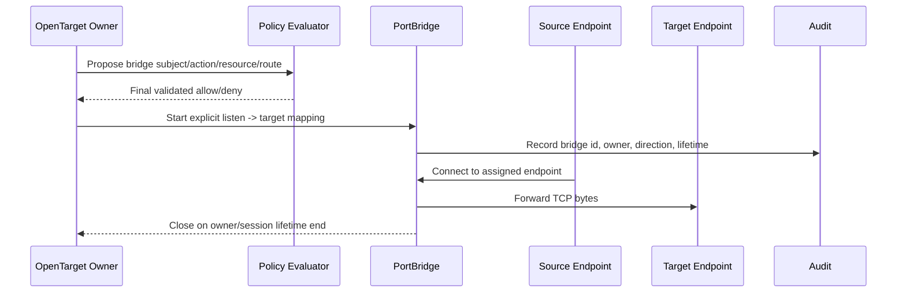
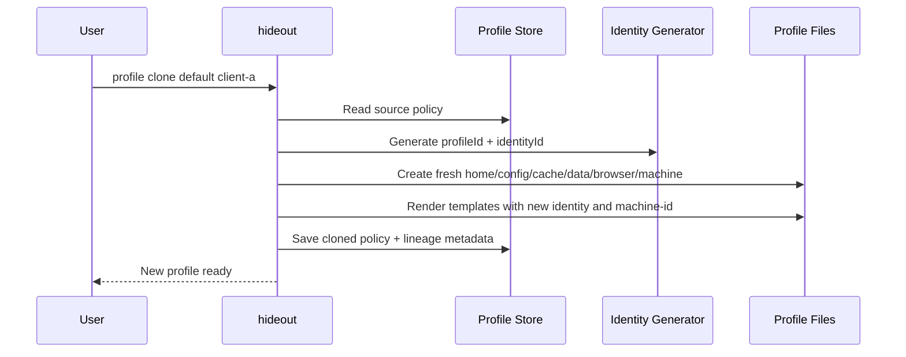
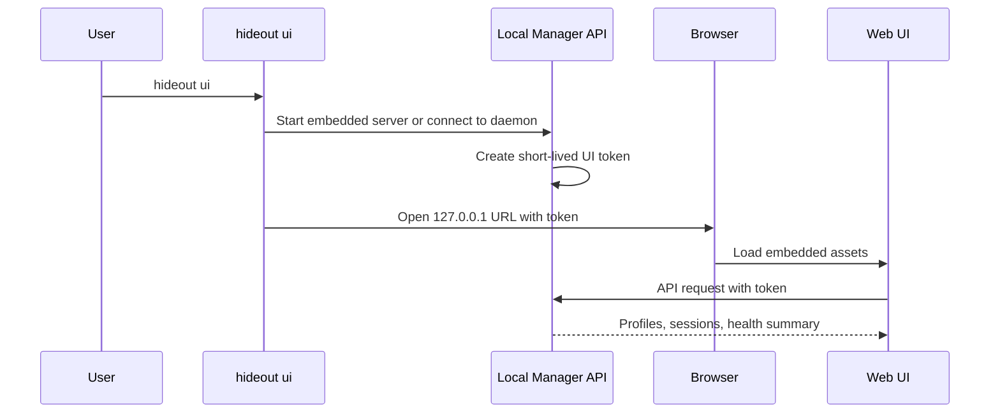

# Hideout Design

<!-- markdownlint-disable MD013 -->

## Document Contract

This is the canonical Phase 1 design document for Hideout. It is a product
contract and an engineering contract. If another document conflicts with this
file, this file wins until the design is intentionally revised.

[threat-model.md](threat-model.md) defines the Phase 1 Lite TCB, claims,
non-claims, hard-deny roots, loopback boundary, and PortBridge invariants used
to evaluate new host reach-back capabilities under this contract.

Delivery terms:

```text
Required Phase 1
  Must ship for the first usable local privacy runner.

Design-ready Phase 1
  Domain model, API shape, schema, or UI model must be stable, but the complete
  user-facing feature does not have to ship in the first CLI release.

Capability Probe
  Minimal executable experiment used to prove or reject a capability before the
  architecture is finalized. Probe code may live in internal packages, tests, or
  non-default lab commands, but it is not a user-facing product promise.

Later
  Explicitly outside the first release path.

Out of scope
  Not a product goal under this design. Adding it requires revising this
  document instead of treating it as backlog.
```

Normative language:

```text
must / must not
  Binding product and engineering contract.

should / recommended
  Preferred design direction. Deviations need an explicit reason.

may
  Allowed behavior, not a delivery promise.
```

Conflict order:

1. Non-negotiable boundaries.
2. Phase 1 cut line.
3. Capability policy model.
4. Backend, broker, and command proxy contracts.
5. Product/UI specifications.
6. Implementation plan.

Interpretation rules:

- This document is a release gate, not an idea backlog. Anything not classified
  here is not part of Phase 1 until this document changes.
- Required Phase 1 means implemented end to end, wired into `hideout run` when
  relevant, covered by tests or `doctor`, and represented in `explain` or audit
  when observable.
- Design-ready Phase 1 means the contract may exist and tests may cover it, but
  `hideout run` must not depend on the full user-facing feature. If a
  Design-ready feature ships early, it must remain additive, tested, explicitly
  documented, and unable to weaken any Required boundary.
- Capability Probe means "prove the capability with the smallest useful
  experiment." Probe code must stay off the default `hideout run` path, must not
  create hidden authority, and must fail closed if accidentally reached from a
  product path.
- Later terms may appear as protocol vocabulary or interface placeholders. They
  are not permission to ship broad hooks, generic host execution, or implicit
  fallbacks in Phase 1. If a Later route, action, or feature is reached at
  runtime before it is reclassified, it fails closed.
- If compatibility conflicts with a privacy boundary, the privacy boundary wins
  and the operation fails closed.
- If two sections appear to conflict, apply the conflict order above and choose
  the narrower authority.

## Product Definition

Product name:

```text
Hideout
```

Canonical user-facing command:

```text
hideout run -- <command> [args...]
```

Legacy design term:

```text
privacy-run
```

`privacy-run` may remain in old notes, filenames, or internal discussion. It is
not a Phase 1 binary name, public command alias, or second product name.

Hideout runs a local command in the current workspace with a controlled privacy
profile. The command keeps normal project read/write behavior. Outside the
deliberately shared workspace, it does not see the user's real home,
credentials, proxy env, shell identity, browser profile, machine identity, or
persistent app identifiers unless the user explicitly allows a capability.

Product statement:

```text
Hideout lets a developer run an unknown or overly curious local CLI in the
current project while replacing host identity, home/config/cache, sensitive env,
proxy env, browser profile, and selected host escape hatches with a controlled
profile.
```

Workspace contents and workspace metadata are deliberately shared with the
target command. In `pathMode=preserve`, this includes host path shape such as the
username in `/Users/<name>/project`. That is a compatibility choice, not an
identity-hiding guarantee. Use `pathMode=alias` when path privacy is more
important than exact path compatibility.

User mental model:

```text
I am still working in my real project directory,
but the process is not running as my real machine identity.
```

Hideout is not tied to any specific AI tool, package manager, JavaScript
runtime, or vendor CLI.

Privacy scope:

```text
Protect by default:
  host home, host env secrets, proxy credentials, real browser profile, real
  machine identity, real app identity/state, selected host escape hatches.

Shared by design:
  the current workspace, workspace metadata, and workspace contents.

Explained but not solved in Phase 1:
  direct network egress identity, workspace secrets, behavioral correlation,
  privileged guest inspection of guest-local runtime state, and deep browser or
  hardware fingerprinting.
```

## Phase 1 Goal

Phase 1 ships a usable local privacy runner, not a sandbox research demo and
not a full enterprise policy platform.

The successful first release lets a developer:

- install Hideout;
- run one command in the current repo;
- keep reading and writing project files normally;
- use a fake home and fake identity;
- hide sensitive env and proxy env from the target process;
- optionally route egress through a hidden proxy path;
- open URLs and workspace files through a brokered host path;
- inspect what was allowed, denied, faked, inherited, and audited.

Primary users:

- developers running AI agents or third-party CLIs against local projects;
- security-conscious engineers who want evidence about what a tool could see;
- platform/security engineers evaluating whether Hideout can become a team
  policy product later.

Do not optimize Phase 1 for:

- non-technical consumer workflows;
- remote execution;
- fleet management;
- enterprise policy distribution;
- perfect anti-fingerprinting across every OS and browser signal.

## Non-Negotiable Boundaries

These rules define the product. Do not weaken them for compatibility.

- Never mount the real host home by default.
- Never pass proxy env to the target process by default.
- Never use the real browser profile by default.
- Never mount the host Docker socket by default.
- Never silently fall back from guest execution to host execution.
- Never expose a generic `host.exec`, `host.run`, or "run any host command"
  capability.
- Never treat Command Proxy as full guest process enforcement.
- Never use Command Proxy as the long-term mechanism for ordinary file access
  commands such as `ls`, `cat`, `stat`, Node `fs`, or Python `open`.
- Never treat broker endpoint reachability as authorization.
- Never let a script bypass the final capability validator.
- Never clone identity material unless the user chooses an explicit migration or
  identity export command.
- Never make workspace-outside host files visible merely because their host path
  string is known. Host file visibility outside the workspace must come from an
  explicit HostFS grant.

Privacy-sensitive uncertainty fails closed. Compatibility-only uncertainty may
warn only when no private data is exposed.

## Design Principles

- Prefer isolation over hooks.
- Preserve workspace ergonomics.
- Make every host escape hatch explicit, narrow, brokered, and auditable.
- Keep profile JSON and capability proposal JSON as the canonical contracts.
- Use scripts only as constrained extension points.
- Copy policy by default, never identity material.
- Keep sensitive values usable without making them readable when possible.
- Make safe defaults do the work; use `explain`, `doctor`, audit, and UI to make
  tradeoffs visible.
- Keep Phase 1 as one complete vertical slice instead of many partial surfaces.

Development rule:

```text
Flexible behavior is allowed only inside explicit domains, registered extension
points, validated capability decisions, and auditable state transitions.
```

When adding a feature, answer in order:

1. Does it violate a non-negotiable boundary?
2. Which domain object owns it?
3. Is it a capability?
4. What is the subject/action/resource/route/decision shape?
5. Which layer enforces it?
6. How does it fail?
7. How is it explained?
8. How is it tested?
9. Is it Required Phase 1, Design-ready Phase 1, Later, or out of scope?

## Capability-First Development

Hideout develops risky or unclear system capabilities in this order:

```text
capability probe -> architecture contract -> product implementation
```

Capability probe:

- proves whether a behavior is technically possible on the target backend;
- uses the smallest useful harness, such as one listener, one target endpoint,
  one browser control handshake, or one guest preview service;
- records backend assumptions, OS assumptions, privileges, exposed endpoints,
  cleanup behavior, and failure modes;
- includes tests or a reproducible manual command;
- stays off the default `hideout run` path.

Architecture contract:

- assigns the proven capability to a domain object;
- defines subject, action, resource, route, decision, lifetime, and audit shape;
- states which layer enforces it;
- states which inputs fail closed;
- states which parts remain backend-specific.

Product implementation:

- wires the contract into CLI, profile, manager API, broker, audit, explain,
  doctor, and cleanup only after the contract is stable;
- ships only when it has a user-facing policy, tests, and rollback behavior;
- must not use the probe harness as an implicit compatibility fallback.

Promotion rule:

```text
A capability can move from probe to implementation only after the architecture
contract names the owner, authority, endpoint exposure, policy guard, audit
event, cleanup path, and failure mode.
```

## Phase 1 Cut Line

Phase 1 is complete only when the Required Phase 1 items and acceptance criteria
below are satisfied. Design-ready Phase 1 items may define stable contracts, but
they must not become runtime dependencies for `hideout run`. Later and out of
scope items must not be implemented implicitly through broad hooks, generic host
execution, or undocumented compatibility fallbacks.

Read this section as the release gate. Later sections may add detail, examples,
or implementation sequencing, but they do not promote Design-ready or Later work
to Required Phase 1 unless that work is also listed here or in the acceptance
criteria.

Acceptance criteria at the end of this document are part of Required Phase 1.
The implementation plan is sequencing guidance only; it cannot weaken or defer a
Required item.

The blocking first-release path is:

```text
hideout run
  -> embedded manager core
  -> selected backend boundary
  -> target command
  -> audit and cleanup
```

Everything outside that path is either a contract used by this path or a
non-blocking observation/control surface. A daemon, HTTP API, Web UI, prompt
loop, or future backend must not be required to make the first local runner work.

Release discipline:

- Required Phase 1 items are release blockers.
- Design-ready Phase 1 items are interface commitments, not hidden release
  blockers.
- Optional smoke surfaces may observe Required behavior, but they must not add
  new authority, new policy semantics, or a dependency that `hideout run` needs.
- Later and out-of-scope features must fail closed or stay absent when referenced
  by profile data, scripts, broker requests, manager API calls, or UI controls.

Required Phase 1:

- CLI: `init --no-input`, `run`, `explain`, `doctor`, `doctor --fix --dry-run`, `cleanup`, `profile init`, `profile clone`, `profile path`.
- Embedded manager core with stable domain APIs. A daemon or web server is not
  required for the first CLI release.
- Profile schema, defaults, validation, and generated identity store.
- Persistent profile identity and `--ephemeral` session identity. Ephemeral runs
  fork identity material for one session and must not mutate or reuse the
  persistent profile identity material.
- Lima backend on macOS as the first real isolation backend.
- Explicit weak native backend for development only.
- Workspace read/write passthrough.
- Fake `HOME`, `TMPDIR`, XDG config/cache/data, `.gitconfig`, user, hostname,
  machine-id, timezone, and locale.
- Sensitive env denylist, conservative env allowlist, and synthetic identity env.
- Secret refs for sensitive host values that must be usable by Hideout without
  becoming readable by the target process.
- Network modes: `direct` and guest-side `tun2socks`.
- Proxy credentials absent from target env and audit.
- Command Proxy support for `open` and `xdg-open`, with both enabled in the
  default profile.
- Host Broker action `host.open` for URLs and mapped workspace files.
- Isolated browser profile for URL open.
- Centralized capability evaluator.
- Constrained `goja` support for command policy and audit redaction hooks.
- JSONL audit log enabled by default and readable `explain`.
- `doctor` checks for backend, generated Lima YAML, profile, env, network,
  broker, mount, policy, and required helper binaries.
- Automatic session cleanup for ephemeral and secret-bearing state.

Design-ready Phase 1:

- `hideoutd` daemon mode.
- Broader Manager API resource model over Unix socket or localhost loopback.
- Minimal Manager API run resources: `run/plan`, `run/apply`, and `run/status`
  over the local token-protected server.
- Local Web UI page map and data model.
- OpenTarget and PortBridge domain contracts for future host application
  automation and preview workflows. The contracts may have internal transport
  tests, but `hideout run` and `host.open` must not depend on them in Phase 1.
- Profile identity rotate/reset.
- Audit query API.
- More complete policy editing surfaces.

Capability Probe Phase 1:

- PortBridge loopback forwarding and cleanup.
- Native loopback/control-plane mechanics for one explicit TCP endpoint.
- Lima guest-to-host bridge mechanics for one explicit host loopback TCP
  endpoint.
- Lima host-to-guest bridge mechanics for one explicit guest TCP endpoint.
- Browser-control probe using an isolated browser profile and a loopback-only
  control endpoint, without exposing it through `host.open`.
- Preview-open probe that maps one guest HTTP service to one host-visible URL,
  without granting general host-local or guest-local network access.
- Broker token, audit, and policy-deny probes around each bridge direction.

Later:

- Browser automation through DevTools or remote debugging.
- Docker, IDE, clipboard, SSH agent, keychain, or host credential brokering.
- Full guest process audit.
- Runtime patching of Node, Bun, or other runtimes.
- Package attribution inside bundled binaries.
- Remote execution.
- Cloud service, login, team policy sync, or fleet management.
- Full visual Web UI. A read-only smoke surface may ship only when it stays
  additive and does not delay or redefine the required CLI runner.

Phase 1 fixed decisions:

| Topic | Decision | Non-goal |
| --- | --- | --- |
| Product shape | Local CLI privacy runner. | Cloud control plane or remote execution. |
| Default backend | Lima on macOS. | JS injection, runtime hook, or host fallback. |
| Weak backend | Native only with `--backend native --allow-weak-isolation`. | Automatic compatibility fallback. |
| Workspace | Read/write passthrough. | Hiding secrets already inside the workspace. |
| Additional passthrough mounts | Explicit user opt-in read/write or read-only backend mounts. | Treating host paths as mounted because they are addressable through HostFS. |
| Identity | Generated fake home/env/browser/machine state. | Importing real host home, browser, or credentials. |
| Hidden proxy | Guest-side routing through `tun2socks`. | Effective-but-unreadable process env. |
| Host escape | `host.open` through Host Broker. | Generic host command execution. |
| Host files outside workspace | HostFS Portal with explicit grants. | Dynamic broad home mounts, `ls/cat` command proxy, or symlink/copy shadow hacks. |
| Command visibility | Registered Command Proxy shims only. | Auditing every guest child process. |
| Environment reuse | Reuse by profile plus workspace. | Reusing runtime secrets or capability tokens. |
| Capability probes | Minimal experiments may exist off the default run path. | Treating probes as shipped authority or product promises. |
| Web UI | Domain/API model and optional read-only smoke surface. | Required visual console for first usable CLI. |

## Domain Model

Treat these as stable contracts.

| Object | Meaning | Phase 1 responsibility |
| --- | --- | --- |
| Profile | User-editable privacy policy and defaults. | Owns env, identity defaults, workspace defaults, network mode, command proxy policy, tool presets, and script refs. |
| IdentityStore | Generated identity material for persistent profiles and ephemeral sessions. | Owns fake home/config/cache/data/browser state and guest machine identity for the current identity root. |
| Environment | Resumable isolated environment for one profile and one normalized workspace. | Design-ready default runtime model. It owns reusable guest tool/cache/home state but must not own broker tokens, proxy secret files, network routes, active shims, or other per-run authority. |
| Session | One command execution under one profile. | Owns session ID, workspace mapping, backend run, broker endpoint, shims, audit file, and explain snapshot. |
| Backend | Execution substrate. | Starts Lima guest, mounts workspace and current identity runtime state, prepares tools, launches command, streams stdio. |
| CapabilityPolicy | Canonical permission model. | Evaluates subject/action/resource/route/decision using JSON rules and optional scripts. |
| CommandProxy | Guest-visible registered command shim system. | Normalizes explicitly registered commands. Phase 1 ships `open` and `xdg-open` for brokered `host.open`; other routes are protocol vocabulary unless named elsewhere as Required. |
| HostBroker | Host-side capability authority. | Executes approved host actions such as `host.open` after policy validation. |
| HostFSPortal | Guest-visible filesystem portal for explicitly granted host paths. | Design-ready long-term host file access model. It owns path grants, filesystem RPC, metadata filtering, and audit for host paths outside the workspace. Initial implementation target is Linux guest; Windows native adapter is Later. |
| HostPathGrant | Explicit authority record for one host path scope. | Design-ready contract for `stat`, `read`, `list`, and later write operations on workspace-outside host paths. |
| PassthroughMount | Explicit backend mount outside the workspace. | Design-ready opt-in compatibility escape hatch. It owns host path, guest path, read/write mode, lifetime, explanation, and audit. It is broad authority and must not be created implicitly by HostFS. |
| AccessSensor | Guest-side observation plane for suspicious access attempts. | Later. It may observe and summarize guest filesystem, process, or network probes for audit and user warnings, but it must not be required for HostFS data access or authorization. |
| OpenTarget | Typed host or guest application target behind an explicit brokered action. | Design-ready contract. Phase 1 implements only `host.open` URL and workspace file targets; browser-control, IDE, Docker, and preview targets are Later implementations. |
| PortBridge | Auditable TCP bridge between explicit listen and target endpoints. | Design-ready transport primitive. Phase 1 may test loopback forwarding, but `hideout run` and `host.open` do not create port mappings. |
| NetworkPolicy | Egress model for a session. | Supports `direct` and guest-side `tun2socks` with hidden proxy env. |
| SecretRef | Named reference to a sensitive host value. | Resolves availability for setup components without exposing secret values to target env, audit, explain, broker requests, or Web UI. |
| AuditLog | Evidence trail. | Records setup, policy decisions, broker requests, redactions, and session result. |
| ExplainSnapshot | Human-readable privacy summary. | Makes each run understandable without reading raw JSON. |
| ManagerCore | In-process local control plane. | Coordinates profiles, sessions, backends, capabilities, broker, network, secrets, audit, settings, CLI, and future UI/API surfaces. |

Avoid adding new first-class objects in Phase 1 unless they clearly belong to one
of these domains.

## Trust Boundaries

Hideout has six trust domains:

```text
Host
  The real machine. Contains real home, credentials, browser profiles, keychain,
  Docker socket, editor state, and network identity.

Guest
  The isolated execution environment. Runs the target command, child processes,
  fake home, command proxy shims, and optional guest network engine.

Workspace
  A deliberate shared read-write boundary between host and guest. It is not
  private from the guest.

Broker
  Host-side authority that executes selected host actions after policy checks.

HostFS Portal
  Guest-visible filesystem facade for explicitly granted host paths. It exposes
  only policy-approved filesystem metadata and bytes, never the host filesystem
  as a raw mount.

Profile/Identity Store
  Persistent policy and generated identity material.
```

Workspace data is outside Hideout's privacy guarantee. If a secret, token,
absolute path, account ID, or real identity marker is inside the mapped
workspace, the target command may read it unless a future workspace filtering
capability explicitly removes it.

Backend mounts must expose only the identity runtime paths that the target
needs, such as fake home, config, cache, data, browser state, and generated
machine identity. Profile control-plane files such as `profile.json`,
`identity.json`, `policy/`, and manager metadata are host-side state and must
not be mounted into the guest unless a future capability explicitly allows it.

Session mounts follow the same rule. The guest may see session runtime
directories such as `tmp/`, `shims/`, `network/`, `bootstrap/`, and
`identity/` when `--ephemeral` is used, but not the session root as a whole.
Session control-plane files such as `audit.jsonl`, `lima.yaml`,
`tool-preset.json`, `broker-endpoint.json`, and `network-plan.json` stay
host-side unless explicitly needed by a guest runtime component.

Boundary defaults:

| Boundary | Default | Notes |
| --- | --- | --- |
| Guest -> workspace | Allow read/write | Preserves local workflow. Workspace secrets are visible. |
| Guest -> additional passthrough mount | Deny unless explicitly mounted | When mounted, follows the user-selected read/write or read-only mode and backend filesystem semantics. |
| Guest -> host home | Deny | Real home is not mounted by default. |
| Guest -> HostFS Portal | Deny unless granted | Ungranted paths are hidden as missing. Granted paths are filtered and audited. |
| Guest -> broker | Restricted | Requires session/action/resource/route/token validation. |
| Guest -> internet | Direct or `tun2socks` | Direct exposes network identity; `tun2socks` hides proxy env from target env. |
| Broker -> host browser | Isolated profile | Real browser profile is opt-in Later behavior. |
| Broker -> host Docker | Deny | Later high-risk capability. |
| Profile clone -> identity material | Deny | Default clone regenerates identity. |

## Capability Policy

All sensitive actions use one canonical shape:

```text
subject -> action -> resource -> route -> decision
```

Definitions:

```text
subject
  Who is asking. Phase 1 subjects are command proxies and session/network setup.

action
  What is requested, such as host.open, guest.exec, or network.connect.

resource
  What the action applies to: URL, guest path, mapped workspace file, proxy
  secret ref, browser profile, or network route.

route
  How the request is handled: guest-direct, guest-exec, host-broker, lab-probe,
  fake, deny.

decision
  allow, deny, ask, audit-only.
```

Decision semantics:

```text
allow
  The action may proceed through the validated route.

deny
  The action must not proceed. The route must be deny.

ask
  The action needs an interactive prompt. If no prompt channel exists, it fails
  closed as deny. The required Phase 1 CLI runner has no mandatory prompt
  channel, so `ask` behaves as deny unless an explicit prompt surface is added.

audit-only
  Record an observation or non-sensitive setup decision without granting a host
  side effect. It never authorizes route changes or host side effects. A host
  capability such as host.open still needs allow.
```

`schemas/policy.schema.json` validates product runtime capability proposals. It
is not a second profile format. User-editable shorthands such as
`hostCapabilities`, `commandProxy`, `policy.maxCapabilities`, and script refs
live in the profile schema, then compile into this proposal shape before the
final validator makes a decision. Capability Probe lab requests may use a
separate lab schema or subject-aware validator extension because probe authority
is not grantable by normal profile policy. The product policy schema must reject
probe actions and routes even when a lab validator exists.

`policy.maxCapabilities` is an upper bound, not a grant. A capability still
needs a valid subject, action, resource, route, decision, profile rule, and hard
validator approval before anything happens.

Rules:

- Policy evaluation is centralized.
- Command Proxy and Host Broker call the same evaluator.
- Deny wins over allow.
- More specific rules win over broad wildcard rules.
- `ask` fails closed when no interactive prompt channel exists.
- Decisions produce audit metadata even when denied.
- Secrets are referenced by name, never embedded in policy output or audit.
- Scripted policy may propose a decision; the final validator enforces hard
  guards, registered actions, resource bounds, and route constraints.

Authority interpretation:

- An action name is vocabulary, not implementation permission.
- A route is executable only when this document marks it Required or a
  registered implementation exists.
- Profile shorthands and scripts propose capabilities; the final validator is
  the only place that grants or denies them.
- Unknown action names, unknown routes, and mismatched subject/action/resource
  combinations fail closed.

Good capability names describe authority:

```text
host.open
host.browser.open
host.ide.openWorkspaceFile
host.clipboard.write
host.docker.runContainer
host.fs.read
host.fs.list
host.fs.write
guest.exec
```

`network.connect` in Phase 1 means session network setup and route verification.
It is not a per-socket firewall, per-request audit system, or packet policy
engine.

Route verification is setup evidence. It proves that Hideout installed the
selected session route, kept required local endpoints reachable, avoided a proxy
endpoint loop, and configured DNS behavior for the selected route before the
target command starts. It does not imply ongoing packet inspection after launch.

`guest.exec` is the authority name for executing inside the guest boundary. In
Phase 1 it is always scoped to either the top-level command launched by
`hideout run` or a registered Command Proxy shim that executes the corresponding
real guest binary. It is not authority to observe, intercept, or run arbitrary
guest processes.

Phase 1 capability implementation matrix:

| Action | Allowed subjects | Valid handling | Non-goal |
| --- | --- | --- | --- |
| `host.open` | `command:open`, `command:xdg-open` | `route=host-broker`; Host Broker opens an isolated browser URL or mapped workspace file. | Generic host command execution. |
| `guest.exec` | top-level run or registered command proxy shim | `route=guest-direct` for the top-level command; `route=guest-exec` only for an explicitly registered shim that execs the matching real guest binary without host side effects. | Intercepting arbitrary guest commands. |
| `network.connect` | session setup | `route=guest-direct` for setup and route verification evidence for `direct` or `tun2socks`; `route=deny` on failure. | Per-socket firewalling or request audit. |

Any action outside the Phase 1 implementation matrix and Capability Probe matrix
is unsupported in Phase 1 and fails closed before it reaches an implementation.

HostFS actions:

| Action | Allowed subjects | Valid handling | Non-goal |
| --- | --- | --- | --- |
| `host.fs.stat` | HostFS guest daemon | Host Broker validates HostPathGrant and returns filtered metadata. | Revealing existence for ungranted paths. |
| `host.fs.read` | HostFS guest daemon | Host Broker validates exact-file or directory grant and streams file bytes. | Broad host home mount. |
| `host.fs.list` | HostFS guest daemon | Host Broker validates directory grant and returns grant-filtered entries. | Enumerating ungranted host directories. |
| `host.fs.write` | HostFS guest daemon | Later write-class operation with explicit grant and audit. | Default write access to host files. |

`host.fs.stat`, `host.fs.read`, and `host.fs.list` are implemented for the
Phase 1 read-only HostFS data plane. `host.fs.write` remains a Later
write-class action and fails closed in Phase 1. Phase 1 write-class attempts
must not mutate the host filesystem; they return a read-only or unsupported
failure and emit audit with `policyEffect=unsupported`.

Capability Probe action matrix:

| Action | Allowed subjects | Valid handling | Non-goal |
| --- | --- | --- | --- |
| `portbridge.probe` | `lab:portbridge` | `route=lab-probe`; explicit listen and target endpoints, explicit direction, test-only lifetime, audit required. | Product tunnels or default run path exposure. |
| `browser.control.probe` | `lab:browser` | `route=lab-probe`; isolated browser profile, loopback-only control endpoint, no `host.open` exposure. | Shipping browser automation. |
| `preview.open.probe` | `lab:preview` | `route=lab-probe`; one guest HTTP service mapped to one host-visible URL for the probe lifetime. | General guest-local or host-local network access. |

`lab-probe` is executable only from an explicit lab harness or lab CLI command.
It must not be selected by profile defaults, Command Proxy shims, Host Broker
product requests, manager UI controls, or `hideout run`. Probe actions require a
subject-aware lab validator. Product policy scripts may not mint probe authority,
and the product validator must reject probe actions. The lab validator is a
separate authority for explicit lab subjects only.

Bad capability names describe escape hatches:

```text
host.exec
host.run
host.native
host.allow
```

## Scripted Policy

Hideout supports constrained JavaScript policy hooks through `goja`.
The extension architecture is detailed in
[script-extension-architecture.md](script-extension-architecture.md).

Key rule:

```text
Scripts are decision extensions, not isolation boundaries.
```

Secondary rule:

```text
Go Core owns capabilities; JavaScript composes proposals.
```

Hideout should inject a constrained SDK, not raw Go objects. The normative SDK
classes and delivery phase are defined in
[script-extension-architecture.md](script-extension-architecture.md). The SDK
must not expose raw Go standard library packages, host filesystem handles, host
HTTP clients, process APIs, environment APIs, backend driver handles, broker
tokens, mutable profile stores, or Manager mutation APIs. Safe context queries
are not part of the required Phase 1 ABI.

Required Phase 1 scripts may:

- classify resources;
- propose a decision such as allow, deny, ask, or audit-only for the current
  request;
- propose only a route that is valid for the current request and implemented in
  the current release;
- produce reason strings and audit tags;
- redact command-specific audit fields.

For the required Phase 1 `open` and `xdg-open` proxies, the only side-effecting
route is `host-broker` for `host.open`; `deny` is the only required negative
route. `guest-exec` and `fake` are stable protocol vocabulary, but they do not
become executable routes until a registered implementation exists.

Command argument normalization is required in Phase 1, but it is builtin and
registry-owned. User-scripted `command.normalize` is Design-ready only; it must
not delay or weaken the first local runner.

Scripts must not:

- read files;
- read env;
- access network;
- spawn processes;
- access host secrets;
- mutate profile state;
- authorize capabilities directly;
- create action names at runtime;
- depend on mutable global state.

Script inputs contain only sanitized policy context supplied by Hideout. They do
not expose host env, process env, secret values, real home paths, or arbitrary
filesystem reads.

Domain-specific behavior belongs in adapters and recipes above Core. For
example, browser preview, browser control, adb access, simulator workflows, MCP
integration, and tool-specific command compatibility should map intent into
HostFS, OpenTarget, PortBridge, Network, or Command Proxy proposals. They should
not add raw host execution or direct subsystem handles to the script runtime.

Runtime contract:

- no `require`, `import`, CommonJS, ESM, Node APIs, timers, filesystem, network,
  process, or environment access;
- no direct access to secret values, only secret refs;
- deadline per call;
- source size, input size, output size, and compiled script count limits;
- fail closed on parse error, runtime error, timeout, or invalid return shape;
- one `goja.Runtime` per evaluation or a guarded pool keyed by script hash.

Phase 1 default limits:

```text
source: 64 KiB
input context: 64 KiB JSON
output proposal: 16 KiB JSON
script refs: 16 per profile
execution timeout: 100 ms per parse/evaluate step
```

Phase 1 scriptable extension points:

`Required` means the extension point ABI must exist and be testable in the first
local runner. `Design-ready` means the contract should stay stable, but the
feature does not have to be user-facing in the first CLI release. A profile may
still use only builtin policy with no user script.

| Extension point | Phase | Purpose |
| --- | --- | --- |
| builtin command normalization | Required | Parse registered argv/cwd metadata into a canonical request. |
| `command.normalize` | Design-ready | User-scripted normalization for future command families. |
| `command.decide` | Required | Propose valid route, action, resources, decision, and reason for the current request. |
| `audit.redact` | Required | Redact command-specific fields before writing audit. |

Later scriptable extension points:

- `env.decide`;
- `broker.decide`;
- `network.decide`;
- `profile.materialize`.

Scripts live in the host profile store, not inside the mounted workspace. For
Phase 1, `scriptRefs.path` values must be slash-separated relative paths under
the profile root, must start with `policy/`, and must not use absolute paths,
backslashes, or `..` path segments. Guest shims do not execute scripts.

Script context is the canonical policy context, not the raw broker envelope.
Hideout must validate and canonicalize command name, subject, route, action,
target, cwd, resource type, and workspace mapping before a command decision or
audit redaction script can inspect them. Scripts must not receive arbitrary
host paths, proxy URLs, capability tokens, raw endpoint addresses, or unbounded
user-supplied envelope fields.

Command policy script proposals must match the current request context. A
`decideCommand` result for a brokered `host.open` request must use
`action=host.open`; `allow`, `audit-only`, and `ask` must also use the current
request route. Mismatched script proposals fail closed and are audited as script
errors. This keeps scripts from smuggling unrelated capability proposals into a
host boundary decision.

For `host.open`, only `decision=allow` with `route=host-broker` may call the host
opener. `audit-only` records evidence and returns without a host side effect.

Phase 1 script ABI:

```text
decideCommand(ctx) -> capability proposal
redactAudit(ctx)   -> { details, reason?, audit? }
```

Any missing entrypoint, invalid return shape, unsupported route/action, or
oversized output fails closed.

## Architecture

First implementation path:

```text
Go launcher
  + embedded manager core
  + Lima backend on macOS
  + fake home/env
  + workspace passthrough
  + command proxy shims
  + small host broker
  + audit/explain
```

Logical components:

```text
cmd/hideout
  CLI entrypoint.

internal/profile
  Profile schema, defaults, identity store, validation, and merge logic.

internal/manager
  Local control plane for profiles, sessions, backends, secrets, audit, prompts,
  and Web UI API. The embedded core is Required Phase 1; daemon/socket serving
  is Design-ready Phase 1.

internal/backend
  Backend interface and common session model.

internal/backend/lima
  Required macOS Lima backend.

internal/backend/native
  Explicit weak development backend only.

internal/broker
  Host broker server, request validation, and policy evaluator integration.

internal/cmdproxy
  Command proxy registry, request normalization, and route mapping.

internal/policy
  Canonical capability evaluator, constrained goja script runner, script SDK,
  hard guards, and decision validation. JavaScript returns proposals; Go
  validators remain the final authority.

internal/network
  Direct networking and guest-side TUN/tun2socks setup.

internal/envpolicy
  Env scrub, allow, deny, fake, and inherited vars.

internal/pathmap
  Host/guest path mapping.

internal/audit
  JSONL audit writer and redaction helpers.

internal/hostopen
  Host browser/file opener used only after Host Broker approval.

internal/portbridge
  Design-ready TCP bridge primitive for future OpenTarget implementations. It is
  not wired into Required Phase 1 `host.open`.

internal/guestaudit
  Future guest-side ordinary process audit. Not Required Phase 1.
```

High-level run flow:

```text
hideout
  -> parse CLI
  -> load profile
  -> validate policy
  -> detect workspace
  -> select backend
  -> create session dirs and audit
  -> materialize fake home/env and shims
  -> prepare network plan
  -> start host broker
  -> start backend
  -> run target command inside backend
  -> stream stdio
  -> write audit events
  -> cleanup session state
```

Logical architecture:

```text
┌─────────────────────────┐
│ Hideout CLI             │
│ parse args, load profile │
└────────────┬────────────┘
             ▼
┌─────────────────────────┐
│ Manager Core             │
│ local control plane      │
└───────┬─────────┬───────┘
        │         ▼
        │   ┌─────────────────┐
        │   │ Policy Evaluator │
        │   │ JSON + goja      │
        │   └────────┬────────┘
        │            ▼
        │   ┌─────────────────┐
        │   │ Host Broker      │
        │   │ host.open/HostFS │
        │   └────────┬────────┘
        │            ▲
        ▼            │
┌─────────────────────────┐
│ Backend Adapter          │
│ Lima first               │
└────────────┬────────────┘
             ▼
┌─────────────────────────┐
│ Guest Environment        │
│ fake home, env, network  │
│ command proxy shims      │
│ workspace passthrough    │
│ HostFS portal mount      │
└────────────┬────────────┘
             ▼
┌─────────────────────────┐
│ Target Command           │
└─────────────────────────┘
```

Run sequence:



Run planning invariant:

- Manager Core owns `PlanRun` before any backend is prepared.
- `PlanRun` must validate command presence before profile or session state is
  created.
- `PlanRun` owns profile load-or-init, temporary run-scoped profile overrides,
  ephemeral identity selection, backend normalization, and workspace mapping.
- Manager Core owns reusable environment selection and environment lifecycle
  transitions: prepare runtime, mark running, mark ready/error, and remove
  `--rm` environments.
- Manager Core owns run session lifecycle setup and teardown: session layout,
  profile/runtime identity paths, env policy materialization, audit writer
  activation, audit close, and sensitive session cleanup.
- Manager Core owns run network setup: direct/tun2socks plan preparation,
  hidden proxy secret materialization, backend-specific runtime verification
  flags, and `network.setup` audit.
- Manager Core owns run data plane setup and teardown before backend execution:
  broker token and endpoint lifecycle, broker endpoint file, command proxy shim
  materialization, HostFS effective policy/service, HostFS guest helper
  materialization, broker env injection, and `session.start` audit.
- CLI, TUI, WebUI, and automation must consume the same `RunPlan` instead of
  resolving these decisions independently.
- Manager Core owns `ApplyRun` after `RunPlan`: policy validation, backend
  availability, pending lightweight store/profile/schema metadata InitTask
  application before session/backend prepare side effects, backend
  prepare/run/cleanup, environment start/finish transitions, `session.end`,
  `backend.cleanup`, and `RunResult`.
- CLI may construct the concrete backend adapter and render `explain`, but
  explain-only session lifecycle goes through Manager `ExplainRun`; CLI must not
  directly assemble the session/broker/network/backend execution sequence.
- Manager API, TUI, WebUI, and automation use the same `PlanRun -> ApplyRun ->
  RunResult` sequence. The local server may supply a backend factory, but API
  handlers must not become a second command execution implementation.
- Manager API `run/apply` may also receive an opener factory from the local
  server so registered command proxies use the same isolated host opener as CLI
  runs. API handlers must not implement a separate host-open path and must not
  silently replace host-open with an unaudited no-op.
- Manager API responses may expose `RunPlan`, `RunResult`, and session status.
  They must not expose broker tokens, broker socket paths, proxy secret values,
  or arbitrary host file contents.

Brokered open sequence:



HostFS read sequence:



PortBridge contract sequence:



Profile clone sequence:



## Technology Stack

Default stack:

```text
Language:        Go
Primary backend: Lima on macOS
Linux backend:   bubblewrap later, not a Phase 1 dependency
Config:          JSON profile, generated Lima YAML
Policy scripts:  goja
Broker IPC:      Unix socket or backend-scoped TCP endpoint with token
HostFS Portal:   Linux guest FUSE daemon over broker RPC
Manager API:     JSON over Unix socket or 127.0.0.1 loopback with token
Port bridge:     Go TCP bridge; guest-reachable listeners are backend-specific
Audit:           JSONL
Web UI:          React + TypeScript + Vite, embedded static assets later
Packaging:       Internal builds first; Homebrew/GitHub releases later
```

Why Go:

- small native binaries with simple distribution;
- strong fit for process management, files, sockets, signals, and CLIs;
- easy to call `limactl`, `bwrap`, `open`, and other host commands;
- keeps the trusted launcher independent from Node, Bun, or Python;
- supports a clean package layout without a large framework.

Recommended Go dependencies:

| Area | Package | Use |
| --- | --- | --- |
| CLI parsing | `github.com/alecthomas/kong` | Typed subcommands and flags. |
| JSON Schema | `github.com/santhosh-tekuri/jsonschema/v6` | Profile, policy proposal, broker, audit, and manager API validation. |
| YAML | `gopkg.in/yaml.v3` | Generate Lima YAML. |
| IDs | `github.com/oklog/ulid/v2` | Sortable profile/session IDs using `crypto/rand`. |
| File locking | `github.com/gofrs/flock` | Protect profile/session mutation. |
| Terminal helpers | `golang.org/x/term` | Terminal detection and future prompts. |
| Platform syscalls | `golang.org/x/sys` | Unix-specific socket, signal, and file mode details. |
| Policy scripting | `github.com/dop251/goja` | Constrained JavaScript hooks. |
| Guest FUSE | `github.com/hanwen/go-fuse/v2` | HostFS Portal mount inside Linux guests. |

Avoid in Phase 1:

- gRPC for broker IPC;
- a long-lived database;
- mandatory GUI framework;
- container orchestration libraries;
- Node-compatible policy scripting.

## Backend Strategy

Required macOS backend:

```text
lima
```

Why Lima first:

- stronger boundary than JS injection or runtime hooks;
- mature local Linux VM workflow on macOS;
- supports workspace mounts and host/guest networking;
- child processes stay inside the guest boundary;
- Linux guest makes fake home, `/etc`, `/proc`, hostname, locale, and common
  developer tools easier to control.

Tradeoffs:

- target command must exist inside the guest;
- native macOS-only binaries cannot run in this backend;
- file watching depends on Lima mount mode;
- startup is heavier than native execution.

Phase 1 Lima decision:

```text
Hideout owns generated Lima instances and generated Lima YAML.
The default is one reusable generated Lima instance per environment.
Backend auto-selection resolves to Lima in Phase 1.
```

`hideout doctor --backend lima` validates the generated Lima YAML with
`limactl validate` before any VM start. This is a host control-plane check: it
may write a temporary session-local YAML file and run `limactl validate`, but it
must not start the VM, install guest packages, run guest bootstrap, or execute
the target command. The `limactl validate` process receives only the Lima host
command allowlist environment, not target env, proxy env, secret refs, or
profile synthetic identity values.

The effective identity root determines the backend identity boundary. A normal
run uses `profiles/<profile>/` as the identity root. An `--ephemeral` run uses
`sessions/<session-id>/identity/` as the identity root and remains
session-scoped. Persistent Lima environments may be reused for startup speed,
but every run still gets fresh session-scoped mounts for shims, broker endpoint
files, network files, and temporary authority. Persistent identity survives
through profile identity-root mounts, not through hidden access to the real host
home. Cleanup must delete session authority every run. Environment cleanup must
delete the reusable Lima instance when the environment is removed.

Ephemeral Lima identity must use session-fork metadata. Backend instance names,
guest hostname material, machine-id material, browser profile paths, and app
state must be derived from the session identity, not from the source profile's
persistent `identityId`.

HostFS Portal for Lima is a Linux guest adapter. It runs a guest daemon and FUSE
mount inside the Lima VM, then forwards HostFS RPC to the host broker. It must
not rely on runtime patching, JS injection, dynamic Lima broad mounts, or
command-specific proxy wrappers.

If Lima is unavailable, auto-selection fails with a backend error. It must not
select the weak native backend unless the user explicitly passes
`--backend native --allow-weak-isolation`.

A shared backend pool may hold only identity-neutral base state. It must not
share home, machine-id, browser profile, app cache, or other identity material
across profiles.

## Environment and Resume Model

This model is the Design-ready runtime model for reducing startup cost while
keeping user mental load low. The user-facing concept is one thing:

```text
Environment = the isolated machine Hideout uses for this project.
```

The implementation still separates reusable environment state from per-run
authority. A reusable environment may keep:

- generated profile identity state for the selected profile;
- guest home/config/cache/data/browser state owned by that profile and
  workspace;
- tool installs, package caches, and other guest-local developer state;
- workspace mount configuration and backend metadata;
- audit history and run metadata.

A reusable environment must not keep active authority from a previous run:

- broker capability tokens;
- broker endpoint files;
- command proxy shims;
- proxy secret runtime files;
- active network routes or `tun2socks` processes;
- active PortBridge, browser-control, preview-open, or DevTools endpoints;
- session tmp files.

Every `hideout run`, including a resumed run, creates a new session ID, broker
token, command proxy shim set, network plan, audit context, and cleanup scope.
Reusing an environment is a startup optimization and a user workflow feature; it
is not permission to reuse per-run capability material.

Default environment selection:

```text
profile + normalized workspace -> most recently used environment
```

`hideout run -- <command>` resolves the current workspace, finds the most
recent resumable environment for the selected profile and workspace, and uses
it. If none exists, Hideout creates one. Changing directories into a different
project selects a different environment. Returning to the original project
selects that project's most recent environment.

`hideout run --new -- <command>` always creates a new environment for the
current profile and workspace. It does not reset the profile identity. It is for
starting from a clean runtime environment while keeping the same configured fake
device/persona. Resetting identity is a stronger profile operation and must not
be hidden behind `--new`.

`hideout run --resume <id> -- <command>` resumes a specific environment. The
resume ID is an environment handle, not a session token. A resume command must
only run from the environment's original workspace or a child directory of that
workspace. If the current directory is outside the environment workspace, the
command fails closed with a message showing both paths. A future explicit
override may exist, but the default must prevent accidentally using one
project's environment to operate on another project.

`hideout run --rm -- <command>` creates a disposable run. It may still use
profile identity defaults, but it removes the runtime environment after the
command exits. This is the equivalent of choosing cleanup over speed for a
higher-risk command.

User-facing environment commands stay intentionally small:

```text
hideout list
hideout clean
```

`hideout list` shows resumable environments, not low-level session internals.
It must include at least:

- short and full environment ID;
- profile;
- backend;
- normalized workspace;
- status;
- created time;
- last started time;
- last ended time when available;
- last command summary.

`hideout clean` removes stopped/stale environments and runtime cache according
to a conservative retention policy. It must preserve audit logs unless the user
uses a future explicit destructive cleanup mode. The default cleanup must not
delete the real workspace.

Suggested user output after a run:

```text
Hideout environment: 16f8850e
workspace: /path/project
resume: hideout run --resume 16f8850e -- <command>
```

The product rule is:

```text
Default reuse by current project. Explicit new when the user wants a clean
environment. Explicit rm when the user wants no environment left behind.
```

Other backends:

| Backend | Phase | Notes |
| --- | --- | --- |
| `native` | Required for development only | Must require explicit `--backend native --allow-weak-isolation`. |
| `bubblewrap` | Later | Preferred Linux sandbox path. |
| Apple Container | Later evaluation | Keep interface compatible; not a Phase 1 dependency. |
| Node/Bun runtime backend | Later evaluation | Separate backend family, not runtime patching in Phase 1. |
| Remote execution | Later evaluation | Separate product path, not the first local runner. |

Backend interface shape:

```go
type Backend interface {
    Name() string
    Available(ctx context.Context) error
    Prepare(ctx context.Context, spec RunSpec) (*Session, error)
    Run(ctx context.Context, session *Session, command []string, env []string) error
    Cleanup(ctx context.Context, session *Session) error
}
```

The backend must not reinterpret profile semantics. A profile means the same
thing across backends even if enforcement strength differs.

## Tool Resolution

Hideout runs the target command inside the selected backend boundary.

For Lima:

```text
hideout run -- tool args
  -> resolve "tool" inside the guest PATH
  -> run it with fake home/env/network/workspace mapping
```

Hideout must not silently execute a host binary when the guest command is
missing. Missing commands should report:

- selected backend;
- profile;
- guest PATH context;
- suggested tool preset or guest install path.

Compatibility paths:

```text
base image
  shell, git, curl, certificates, and common utilities are available.

tool preset
  profile/backend preset installs a known CLI into guest base state or the
  declared identity root.

guest install command
  user installs tools into persistent profile identity state.
```

## Workspace Model

Default workspace:

```text
host cwd
```

Workspace is mounted read/write because preserving local development workflow is
a core product goal.

Preferred path mapping:

```text
host:  /Users/alice/project
guest: /Users/alice/project
```

Fallback path mapping:

```text
guest: /workspace
```

Path modes:

```text
preserve
  Host and guest paths match when possible. Best compatibility, but leaks host
  username and path shape.

alias
  Guest sees a neutral path such as /workspace. Better privacy, but tools may
  display paths that differ from host paths.
```

Phase 1 default:

```text
pathMode = preserve
```

This default optimizes for compatibility with tools that print, compare, cache,
or reopen absolute paths. It intentionally trades off path privacy. `explain`
must show the selected path mode and warn when `preserve` may expose host path
shape. A privacy-hardened profile should set:

```text
pathMode = alias
```

`explain` must state that workspace contents are visible to the guest. This
includes `.env`, `.npmrc`, git remotes, local config files, untracked files, and
generated artifacts. Hideout isolates host identity and host resources; it does
not automatically hide secrets, repo metadata, absolute paths, or identifiers
that live inside the workspace.

Only mapped workspace paths are eligible for Phase 1 host file open actions.

Additional passthrough mounts:

```text
workspace
  Always the primary read/write passthrough boundary.

explicit mount
  User-declared backend mount outside the workspace.

HostFS
  Grant-filtered filesystem portal for all other host-looking paths.
```

An explicit passthrough mount is a compatibility feature, not HostFS. It may be
read/write or read-only according to the user-selected mode. When a path is
inside a passthrough mount, the guest observes backend mount semantics directly:
host and guest can both mutate that tree, file watching depends on the backend,
and conflicts are ordinary shared-filesystem conflicts. Because this is broad
authority, it must be explicit, audited, and shown in `explain`.

Suggested future CLI shape:

```sh
hideout run \
  --mount rw:/Users/alice/Downloads:/Users/alice/Downloads \
  -- tool args
```

Rules:

- no additional host path is mounted merely because a command references it;
- `--mount` must require explicit host path, guest path, and mode;
- writeable mounts must be visibly different from read-only mounts in
  `explain`, audit, and UI;
- mounting `$HOME`, `/Users/<name>`, `/`, `/Volumes`, Docker sockets, SSH agent
  sockets, browser profiles, keychains, or credential directories must require
  special high-risk policy classification;
- additional mounts are not HostPathGrants and do not participate in HostFS
  directory filtering;
- HostFS grants must not silently upgrade to backend mounts.

## HostFS Portal

HostFS Portal is the long-term correct architecture for ordinary file access to
explicitly granted host paths outside the workspace. It is Design-ready in
Phase 1 and must be implemented as a filesystem capability, not as dynamic broad
mounts, command proxy wrappers for `ls` or `cat`, or symlink/copy shadow hacks.

Problem statement:

```text
guest process
  -> ordinary filesystem API
  -> controlled HostFS view
  -> host broker policy/grant/audit
  -> real host filesystem
```

The target program must not need Hideout-specific code. These should all work
the same way once a matching grant exists:

```sh
ls /Users/alice/Downloads/file.dmg
cat /Users/alice/Downloads/file.txt
node script.js /Users/alice/Downloads/config.json
python main.py /Users/alice/Downloads/data.csv
```

HostFS is not workspace passthrough and not an additional backend mount.
Workspace and explicit passthrough mounts are the only default read/write host
filesystem surfaces. HostFS handles host-looking paths outside those mounted
trees and gives each visible path a narrow, auditable authority record.

Product interpretation:

```text
workspace and explicit mounts
  Real backend mounts. Read/write is allowed when the mount mode says so.

HostFS
  Host namespace is addressable through stable portal roots, but entries are
  invisible until a grant exposes them. The first implementation is read-only.
```

It is acceptable to describe HostFS as a controlled read-only host filesystem
view, but not as "the full disk is mounted read-only." The distinction matters:
ungranted files and directories are not visible, even if their path strings are
guessable.

Architecture:

```text
guest process
  -> Linux VFS
  -> /hideout/hostfs FUSE mount
  -> hideout-hostfsd guest daemon
  -> authenticated broker channel
  -> host Hideout broker
  -> HostPathGrant + policy evaluator + audit
  -> OS-specific host path resolver
  -> real host filesystem
```

Audit contract:

HostFS audit records are for the user and management plane to understand what
the target program attempted to access. A `host.fs.*` audit event includes:

```text
op
path=<requested host path>
policyEffect=allow|deny|none|unsupported
policyReason=<safe category>
canonicalized=true, when the requested path resolved through a host symlink
ruleId=<matched HostFS rule id, when any>
source=profile|environment|run, when a rule matched
bytes or entries, when returned
```

`policyReason` is a safe category such as `matched-rule`,
`matched-deny-rule`, `no-matching-grant`, `symlink-target-not-granted`,
`hard-deny`, or `unsupported`. It must not contain the user-provided rule
reason, because the reason can itself contain private information. The audit
path is the requested path, not an additional resolved symlink target or backend
mount implementation path. Broker response stderr also uses generic HostFS
errors such as `hostfs path not found` and does not echo the path back to the
target program.

Read-only write attempts are audit events too. HostFS v1 records the requested
path, operation, `policyEffect=unsupported`, and a safe unsupported reason
without creating, modifying, deleting, or renaming any host file.

Guest path compatibility:

```text
/hideout/hostfs
/Users   -> /hideout/hostfs/Users
/Volumes -> /hideout/hostfs/Volumes
/private -> /hideout/hostfs/private
```

Mount lifecycle:

```text
environment/session start
  -> start hideout-hostfsd
  -> mount /hideout/hostfs
  -> create stable compatibility roots
  -> keep the mounted view empty unless grants allow entries
```

HostFS is mounted before the target command starts. It is not mounted
heuristically after observing a path access. The compatibility entries are
stable portal roots. They must not be created as per-file dynamic symlinks. A
guest path such as `/Users/alice/Downloads/file.dmg` enters the HostFS FUSE
mount, where the portal maps it to a canonical host path and checks grants. The
mapping must not imply that `/Users/alice` is mounted as a raw host directory.

Default behavior:

```text
workspace path
  Allowed by workspace mount.

workspace-outside host path with no grant
  Return ENOENT.

workspace-outside host path with matching grant
  Expose only the granted metadata and bytes.
```

HostFS returns `ENOENT` for ungranted paths instead of `EACCES`. This hides
whether a real host path exists. Directory enumeration is filtered by grants:
if one file in `/Users/alice/Downloads` is granted, listing that directory may
show that file and synthetic parent directories, but must not reveal unrelated
host files.

User experience:

- `hideout explain` must show HostFS roots, active grant count, and whether
  workspace-outside host paths are hidden.
- `hideout list` should show whether an environment has persistent HostFS
  grants without printing sensitive path details by default.
- denied HostFS attempts may appear in audit and UI warnings, but the target
  process still receives `ENOENT`.
- prompts for missing grants are Later and must not block unattended CLI runs
  unless the user explicitly opts into interactive approval.

Grant model:

```text
HostPathGrant {
  id
  hostPath
  guestPath
  ops: stat | read | list | write | create | delete | rename
  scope: exact-file | dir | recursive-dir
  subject: profile | environment | session | command
  ttl: run | session | environment | profile
  createdAt
  expiresAt
  reason
}
```

Grant sources and visibility policy:

```text
profile grant
  Persistent default visibility for a privacy profile. Good for stable,
  user-approved directories such as a public dataset or shared downloads folder.

environment grant
  Visibility bound to one reusable environment and normalized workspace. Good
  for project-specific host paths.

run grant
  One command execution. Good for ad hoc file access from a copied host path.
```

Effective HostFS visibility is the union of active profile, environment, and run
grants after revocation, expiry, deny rules, and hard-deny rules are applied.
Deny rules are evaluated before allow grants. Hard-deny roots are not grantable
through normal profile policy, environment policy, CLI flags, or scripts.

Policy-configured visibility is allowed, but it still compiles to explicit
HostPathGrant records. A directory is not visible because it is under a stable
portal root; it is visible only because an active grant exposes that exact file,
that directory, or that recursive directory scope.

Example profile shape:

```json
{
  "hostfs": {
    "grants": [
      {
        "hostPath": "/Users/alice/Downloads/public",
        "ops": ["stat", "read", "list"],
        "scope": "dir",
        "ttl": "profile",
        "reason": "Shared non-sensitive downloads"
      }
    ],
    "deny": [
      {
        "hostPath": "/Users/alice/.ssh",
        "scope": "recursive-dir",
        "reason": "Credential directory"
      }
    ]
  }
}
```

Hard-deny examples include SSH keys, browser profiles, keychains, cloud
credential directories, Docker sockets, agent sockets, Hideout control-plane
state, and profile identity material. A future enterprise policy may add
organization-specific hard-deny roots, but user scripts must not remove them.

Visibility semantics:

- no active grant returns `ENOENT` and does not reveal parent or sibling names;
- exact-file grants may synthesize only the parent path components needed to
  reach the file;
- parent directory listing for an exact-file grant shows only the granted file;
- non-recursive directory grants list only that directory's granted entries;
- recursive directory grants require explicit syntax and broader audit;
- read/list grants never become backend passthrough mounts;
- run grants expire with the session and must not be reused by a later run.

Initial HostFS implementation should support the read-only subset:

```text
stat
read
list
```

HostFS v1 read semantics:

```text
read-only
  Guest writes through HostFS return EROFS, EPERM, or an unsupported broker
  failure before any host mutation.

live view
  Reads observe the host filesystem at access time. HostFS v1 is not a snapshot
  and does not guarantee consistency across multiple reads.

best effort metadata
  Directory listings and file metadata can change when the host changes.
```

Read conflict behavior:

| Situation | HostFS v1 behavior |
| --- | --- |
| Host modifies a file while guest reads it | Allow normal host OS read semantics; no snapshot guarantee. |
| Host deletes or moves a file before open | Return `ENOENT`. |
| Host deletes or moves a file after open | Existing handle may continue if the host OS permits it; later path lookup returns `ENOENT`. |
| Host changes permissions | Re-check host permissions and grant on open; fail closed when unavailable. |
| Host symlink target changes | Canonicalize and validate at open time; deny if the target escapes the grant. |
| Directory changes while listed | Return grant-filtered best-effort entries; no strong directory snapshot. |
| Guest requests write/create/delete/rename | Return read-only failure until write-class HostFS exists. |

Safety checks must happen at open time, not only at lookup time. Metadata caches
may exist for performance, but grant decisions and canonical host path checks
must not rely on stale cache state.

Implementation cut line:

```text
HostFS v1
  fixed mount roots
  Linux guest hideout-hostfsd FUSE daemon
  broker RPC for stat/read/list
  exact-file read grants
  filtered synthetic parent directories
  read-only file handles
  host-side canonicalization
  deny/allow audit

HostFS v2
  non-recursive directory grants
  recursive directory grants
  metadata cache and large-file streaming optimizations

HostFS v3
  write-class operations
  interactive grant prompts
  Access Sensor correlation
```

This is a staged implementation plan for one architecture, not a set of
throwaway transitions. HostFS v1 must already use the final FUSE/broker/grant
shape.

Write operations are Later until the policy model, audit semantics, conflict
behavior, and host filesystem mutation safeguards are explicit:

```text
write
create
delete
rename
truncate
chmod/chown/xattr
```

Future write-class HostFS must have its own conflict model before it can ship.
At minimum it must decide:

- whether writes are in-place or temp-file plus atomic rename;
- whether overwrite is allowed;
- whether to preserve backups;
- whether to honor advisory locks;
- how to detect host-side modification between open and commit;
- how partial write failure rolls back;
- how write audit records old path, new path, byte counts, truncation, rename,
  delete, and failure without logging file contents by default.

Until these decisions are made, workspace and explicit passthrough mounts are
the only supported way to write host files outside Hideout profile/session
state.

HostFS RPC:

```text
Lookup(parent, name)
GetAttr(node)
Open(node, flags)
Read(handle, offset, size)
ReadDir(node)
Release(handle)
```

Later write RPC:

```text
Create
Write
Truncate
Rename
Unlink
Mkdir
Rmdir
Fsync
```

Security rules:

- Host path canonicalization happens on the host side before grant evaluation.
- Grant checks use the canonical host path, not only the guest path string.
- HostFS deny and hard-deny rules are evaluated before allow grants.
- Host symlinks must not escape an exact-file or non-recursive directory grant.
- Directory grants are non-recursive by default.
- Recursive directory grants require explicit user intent.
- Ungranted path lookup, stat, open, read, and readdir fail closed as `ENOENT`.
- Directory enumeration must be grant-filtered and must not leak unrelated
  names, counts, inode values, or host path existence.
- Broker tokens are session-bound and environment-bound; a guest daemon cannot
  reuse a previous session's HostFS authority.
- Audit records first access, deny, directory listing, and read-only
  write-class attempts. Future write support must audit every write-class
  operation and failure.
- HostFS must never expose the real host home as a broad raw mount.

Platform model:

| Layer | macOS host | Linux host | Windows host |
| --- | --- | --- | --- |
| Host path resolver | Required | Required | Later |
| Linux guest FUSE adapter | Required for Lima | Required for Linux guests | Later via WSL/Linux guest |
| Native host mount adapter | Later; macFUSE/FSKit evaluation only | Later | Later; WinFsp evaluation only |

The first implementation target is:

```text
macOS or Linux host + Linux guest
```

This covers Lima on macOS and future Linux guests. macOS host does not require
macFUSE for this path because FUSE runs inside the Linux guest; the host side is
a normal Hideout daemon reading host files through OS APIs. Windows support is
kept out of the first HostFS implementation path. Windows path, ACL,
case-sensitivity, file-locking, drive-letter, and UNC semantics require a
dedicated resolver and native adapter design.

HostFS is not:

- a dynamic Lima mount;
- a command proxy for `ls`, `cat`, or `stat`;
- a JS/runtime hook;
- a copy cache or symlink tree;
- permission to mount `/Users/<name>`, `$HOME`, `/Volumes`, or `/` broadly;
- a replacement for workspace passthrough.

Access Sensor relationship:

```text
HostFS Portal
  Data plane. Makes explicitly granted host files readable/listable through
  ordinary filesystem APIs.

Access Sensor
  Observation plane. Later capability that may detect suspicious guest access
  attempts and produce audit or user warnings.
```

Access Sensor must not be required for HostFS correctness. HostFS authorization
depends on grants and broker validation, not on eBPF, fanotify, ptrace, or
heuristic command parsing. If Access Sensor ships later, it may help answer:

- which ungranted host-looking paths the target attempted;
- whether the target probed guest identity files such as `/etc/machine-id`,
  `/proc/cpuinfo`, SSH config, shell history, package manager credentials, or
  browser state;
- whether access patterns look like broad discovery rather than task-local file
  usage.

Access Sensor output is advisory unless a separate enforcement policy explicitly
promotes it. It must not grant host filesystem access, create HostPathGrants,
mount new directories, or reveal hidden host path existence to the target
process.

Product CLI shape:

```sh
hideout run \
  --fs read:/Users/alice/Downloads/file.dmg \
  -- tool /Users/alice/Downloads/file.dmg

hideout run \
  --fs dir:/Users/alice/Downloads \
  --fs tree:/Volumes/ProjectAssets \
  -- tool /Users/alice/Downloads/input.txt
```

The exact CLI grammar may evolve, but the authority shape must remain a
HostPathGrant with path, ops, scope, subject, lifetime, and audit. A grant flag
must not silently broaden to parent directories. If the requested path cannot be
canonicalized safely, the run fails before the target command starts.

CLI flag design follows the common shape used by sandbox and container tools:
repeatable resource-scoped flags for additive authority, explicit negative
flags for reduction, and mode flags for disabling a source of inherited
authority. This is closer to the mental model of repeatable Docker/Podman
resource flags, Flatpak-style filesystem allow/deny controls, and bwrap-style
explicit bind decisions than to a generic "last flag wins" config override.
Hideout's canonical HostFS flags are therefore:

```text
--fs
  Add a temporary HostFS allow rule for this run.

--no-fs
  Add a temporary HostFS deny rule for this run.

--no-profile-fs
  Disable profile HostFS allow grants for this run.
```

Initial run grant grammar:

```text
read:/absolute/file
read:/absolute/dir/*.txt
stat:/absolute/file
stat:/absolute/dir/*.txt
list:/absolute/directory
dir:/absolute/directory
tree:/absolute/directory
```

Initial run deny grammar uses the same `kind:/absolute/path` shape:

```text
--no-fs read:/absolute/file
--no-fs read:/absolute/dir/private-*.txt
--no-fs dir:/absolute/directory
--no-fs tree:/absolute/directory
```

HostFS treats the path part of `read:` and `stat:` as a selector. If the path
contains Go glob metacharacters (`*`, `?`, or `[`), the rule is a glob selector;
otherwise it is an exact-file selector. This keeps the CLI close to normal shell
usage:

```sh
hideout run --fs 'read:/Users/alice/Downloads/*.txt' -- tool
hideout run --no-fs 'read:/Users/alice/Downloads/private-*.txt' -- tool
```

Users must quote glob selectors in the host shell. Otherwise the host shell may
expand the pattern before Hideout receives it.

Glob selectors use Go `filepath.Match` semantics:

- `*` and `?` do not match the path separator;
- character classes such as `[abc]` use Go filepath pattern syntax;
- recursive `**` is not a special form in V1;
- patterns must be absolute local paths;
- glob selectors match files for `stat` and `read`; they do not create
  writable or recursive directory authority.

`list:`, `dir:`, and `tree:` do not accept glob selectors in V1. Users should
use `read:` or `stat:` glob selectors for filtered file visibility, and keep
directory grants explicit when broader directory authority is intended.

A glob selector gives filtered parent-directory visibility so ordinary
filesystem APIs work naturally. For example, `read:/Users/alice/Downloads/*.txt`
allows `ls /Users/alice/Downloads` to show matching `.txt` files and allows
`cat /Users/alice/Downloads/a.txt`, while `cat /Users/alice/Downloads/a.jpg`
still fails closed. The filtered list must not reveal non-matching sibling
names.

Run grants compile to session-scoped HostPathGrant records with `ttl=run`.
They are not saved into the profile, do not create backend mounts, and do not
make the host path writable. The guest can benefit from them only when the
HostFS runtime data plane is mounted for that backend.

`--fs` is repeatable. Each flag creates one run-scoped allow grant. Repeating
the flag composes grants for that run only and does not mutate the profile.
Durable grants must be stored in profile or environment policy instead of
inferred from a prior run.

Persistent profile HostFS management:

```sh
hideout profile fs default list
hideout profile fs default add --fs dir:/Users/alice/Public --reason "project input"
hideout profile fs default deny --no-fs read:/Users/alice/Public/private.txt --reason "private file"
hideout profile fs default remove hfs_0123abcd4567
```

`profile fs` is the stable lower-layer management contract for durable HostFS
profile policy. It writes the same `profile.hostfs.grants` and
`profile.hostfs.deny` objects that `hideout run` consumes. Manager APIs and Web
UI must use this rule model instead of inventing a second representation.

Persistent profile HostFS rules must have stable unique IDs. CLI-created IDs
use the opaque `hfs_` prefix. Users and higher layers must treat IDs as opaque
handles for remove/edit operations, not as encoded policy meaning. Run-scoped
rules may omit stable IDs because they are not durable user-managed records.

HostFS authority is composed, not overridden:

```text
profile grants
  + environment grants
  + run --fs flags
  - any matching deny rule
  - hard-deny roots
  = effective HostFS policy for this run
```

`--fs` is an additive, temporary authority source. It does not replace
profile grants, environment grants, or deny rules. A run-scoped grant cannot
open a path denied by profile or environment policy. If a user wants a run with
less authority than the profile baseline, use one of the explicit reduction
controls instead of treating `--fs` as an override:

```text
--no-fs <kind:/absolute/path>
  Adds a run-scoped deny rule. Deny wins over profile, environment, and run
  grants.

--no-profile-fs
  Ignores profile HostFS grants for this run. Profile deny rules still apply.
```

These controls reduce authority only. They must not disable hard-deny roots,
profile deny rules, environment deny rules, or the final capability validator.

Lima runtime behavior:

```text
active HostFS grants
  -> require a Linux hideout-hostfsd binary
  -> start hideout-hostfsd inside the guest
  -> mount /hideout/hostfs with FUSE
  -> expose /Users, /Volumes, and /private as compatibility roots
  -> route stat/read/list through the authenticated Host Broker
```

If the Linux guest lacks `/dev/fuse`, cannot mount FUSE, or the
`hideout-hostfsd` binary is missing, the run fails before the target command
starts. HostFS failure must not fall back to backend mounts, command proxies, or
host execution.

`hideout doctor --backend lima` must check the same runtime prerequisite when
profile HostFS grants are active. If no HostFS grants are active, doctor reports
HostFS inactive and does not require the guest daemon. If grants are active and
the Linux `hideout-hostfsd` cannot be discovered through a packaged location,
the default store binary path, PATH, or an explicit valid
`HIDEOUT_LINUX_HOSTFSD_PATH`, doctor reports an error before a user reaches
`hideout run`. Doctor output must not leak helper search paths or granted host
paths.

Compatibility grafts:

```text
HostFS authorization
  -> broker policy decision
  -> host path resolver
  -> FUSE response

Compatibility path entry
  -> best-effort guest symlink for an active grant directory
  -> never grants data by itself
```

Some backends preserve the workspace host path inside the guest. In that mode,
`/Users`, `/Volumes`, or another compatibility root may already exist because
the workspace mount created parent directories. Hideout must not replace or
broaden those directories. Instead, the backend may create narrow compatibility
graft symlinks for active HostFS grant entry points, such as the parent
directory of an exact-file grant or the granted directory itself.

Compatibility grafts are path-entry plumbing only:

- they are derived from the effective HostFS grants for the current run;
- they are not policy grants, backend passthrough mounts, or durable profile
  state;
- they do not make ungranted files visible if the broker denies the underlying
  `stat`, `read`, or `list` request;
- they are created only for compatibility roots supported by the backend;
- they are skipped on collision instead of replacing existing guest paths;
- they fail closed if the HostFS data plane cannot start.

## Env and Identity

Default env behavior:

- deny known sensitive host vars;
- set synthetic identity vars;
- keep only a conservative allowlist;
- do not pass proxy env by default.

Env merge order is fixed:

```text
host env
  -> deny proxy and sensitive patterns
  -> apply explicit inherit allowlist
  -> add env.public
  -> add synthetic identity env
  -> validate reserved names
```

Deny and reserved-name checks win over `env.public` and `env.inherit`.

Default synthetic vars:

```text
HOME=<guest-home>
USER=developer
LOGNAME=developer
HOSTNAME=devbox
TMPDIR=<guest-tmp>
XDG_CONFIG_HOME=<guest-config>
XDG_CACHE_HOME=<guest-cache>
XDG_DATA_HOME=<guest-data>
GIT_CONFIG_GLOBAL=<guest-home>/.gitconfig
TZ=UTC
LANG=en_US.UTF-8
LC_ALL=en_US.UTF-8
PATH=<shim-dir>:<guest-tool-paths>
```

Synthetic identity env names are reserved. A profile must not set or inherit
`HOME`, `USER`, `LOGNAME`, `HOSTNAME`, `TMPDIR`, `XDG_CONFIG_HOME`,
`XDG_CACHE_HOME`, `XDG_DATA_HOME`, `GIT_CONFIG_GLOBAL`, `TZ`, `LANG`, `LC_ALL`,
or `PATH` through `env.public` or `env.inherit`. The `HIDEOUT_*` namespace is
also reserved for Hideout runtime and control-plane env such as broker endpoint,
session ID, capability token, shim state, and host-only secret backing values.
Use the profile `identity`, `git`, workspace, tool preset, backend, network, and
secret ref fields instead. This keeps identity, git global config, command
resolution, broker authority, and secret plumbing controlled by Hideout instead
of host or profile env.

Default denied patterns:

```text
SSH_*
GITHUB_*
GITLAB_*
VSCODE_*
CURSOR_*
ANTHROPIC_*
OPENAI_*
AWS_*
GOOGLE_*
GCLOUD_*
AZURE_*
HIDEOUT_*
HTTP_PROXY
HTTPS_PROXY
NO_PROXY
ALL_PROXY
FTP_PROXY
http_proxy
https_proxy
no_proxy
all_proxy
ftp_proxy
```

Fake home materialization:

```text
~/.gitconfig
~/.config/      -> current identity root config store
~/.cache/       -> current identity root cache store
~/.local/share/ -> current identity root data store
identity root machine/machine-id -> guest /etc/machine-id and /var/lib/dbus/machine-id
```

The HOME-visible XDG paths and `XDG_CONFIG_HOME`, `XDG_CACHE_HOME`, and
`XDG_DATA_HOME` must resolve to the same generated identity-root state, not to
the host's real home and not to divergent duplicate stores.

The configured identity user is a guest OS identity, not just an environment
variable. Profile validation restricts it to a conservative Linux username so
the Lima backend can pin the guest user name, neutral `/home/<user>` path, and
stable non-host UID in generated YAML. The target command still receives
`HOME=/hideout/profile/home` and XDG/Git paths under the mounted identity root.
The backend must not delete, replace, or symlink the Lima login user's system
home during provisioning because Lima depends on that home for SSH
authorization. The login home may be a neutral guest path, but it must never be
the real host home and must not be mounted from the host.

`GIT_CONFIG_GLOBAL` must resolve to the generated `.gitconfig` in the same
identity root. This prevents host or profile env from redirecting
`git config --global` probes back to the real host git config.

`machine-id` is generated identity material owned by IdentityStore. It is
derived from the current generated identity root, rotates with identity
reset/rotate, is regenerated for `--ephemeral`, and must not be imported from the
host. All guest machine-id files managed by Hideout must contain the same
generated value for that run.

Generated `.gitconfig`:

```ini
[user]
  name = Developer
  email = developer@example.com
```

This handles common probes such as:

```text
git config --get user.email
git config --global --get user.name
```

without allowing reads of the host's real `~/.gitconfig`.

Timezone and locale are env-based in Phase 1. Deeper time, clock, geolocation,
font, browser, CPU, GPU, or OS anti-fingerprinting is Later work.

## Secrets and Hidden Env

Process env has no clean "effective but unreadable" mode. If a secret is present
in the target process environment, JavaScript, native addons, child processes,
and many diagnostics can read it.

Hideout must not implement hidden env by setting a real env var and trying to
hide it with Node/Bun/runtime hooks. Runtime hooks are not a Phase 1 isolation
boundary.

Required model:

```text
secret value
  -> resolved by Hideout setup component
  -> referenced by name in policy/audit/explain
  -> never inserted into target env
```

Secret ref names are stable identifiers, not secret values. Phase 1 secret refs
must be lowercase ASCII names using letters, digits, and `-`, must start and end
with a letter or digit, and must be at most 64 characters. The host env backing
store maps `default-proxy` to `HIDEOUT_SECRET_DEFAULT_PROXY`. Invalid refs fail
closed instead of being normalized into another ref.

`HIDEOUT_SECRET_*` is a host-only backing namespace. It is always denied from
the target env, cannot be reintroduced through `env.public` or `env.inherit`,
and must not appear in audit, explain, command proxy requests, broker requests,
or Web UI responses.

Allowed Phase 1 secret uses:

- network setup resolves `proxySecretRef` to configure guest-side `tun2socks`;
- broker/session setup uses short-lived tokens for the broker endpoint;
- diagnostics report secret availability by ref name only.

Not allowed in Phase 1:

- `HTTP_PROXY`, `HTTPS_PROXY`, `NO_PROXY`, `ALL_PROXY`, `FTP_PROXY`, lowercase
  variants, or credential-bearing equivalents in the target env;
- audit, explain, command proxy requests, broker requests, or Web UI responses
  containing secret values;
- a compatibility mode that makes a target library see proxy env while user code
  cannot read the same env.

If a library only supports proxy configuration through process env, Hideout
cannot make that env value private from code running in the same process. Use
`tun2socks`, a future lower-level network engine, or deny the configuration.

## Network and Proxy

Phase 1 network modes:

```text
direct
tun2socks
```

### Direct

Default mode:

```text
direct
```

No proxy env is passed by default. The guest uses its normal VM network route.

Privacy implication:

```text
direct exposes the guest's normal network egress path.
```

On macOS with Lima this may reveal the user's host network, IP reputation, DNS
behavior, and region. `explain` must show:

```text
Network privacy: direct (host network identity may be visible)
```

### tun2socks

Hidden proxy mode:

```text
Target command
  -> guest kernel route
  -> guest TUN interface
  -> tun2socks
  -> SOCKS/HTTP proxy
  -> network
```

Why guest-side TUN:

- the target process and its child processes do not need `HTTP_PROXY`,
  `HTTPS_PROXY`, or proxy credentials;
- routing is scoped to the privacy guest, not the host;
- it works for packaged binaries because it sits below the runtime;
- it avoids host-wide `pf` or route changes in Phase 1.

Profile shape:

```json
{
  "network": {
    "mode": "tun2socks",
    "proxyEnvVisible": false,
    "proxySecretRef": "default-proxy"
  }
}
```

Boundary guarantee for Phase 1:

```text
Proxy credentials are not present in target env, audit, explain output, command
proxy requests, or broker requests.
```

This guarantee is achieved by network routing below the target process, not by
making process env private.

Phase 1 may store a proxy URL in a mode `0600` session file for the network
engine. This is not a promise that a malicious root process inside the guest
cannot inspect guest-local network engine state. Hardening the network engine
into a smaller privileged component is Later work.

Required behavior:

- reject `tun2socks` if `proxyEnvVisible` is true;
- require a proxy secret ref;
- if a Linux `tun2socks` binary is supplied through
  `HIDEOUT_LINUX_TUN2SOCKS_PATH` or packaged next to the host binary, copy it
  into the session shim directory as a guest-local executable and do not forward
  the host path to the target environment;
- never log proxy credential values;
- fail closed before launching the target command if route setup or route
  verification fails;
- handle DNS explicitly so target-created DNS queries do not use the pre-run
  direct route after `tun2socks` is enabled;
- avoid resolving the proxy endpoint with ordinary DNS before the TUN route is
  active. In Phase 1, the proxy endpoint route target must be an IP literal or a
  guest `/etc/hosts` entry; otherwise setup fails closed.
- stop the guest-side network engine and restore the pre-run default route
  during backend cleanup when Hideout started `tun2socks`;
- keep broker and workspace-local traffic reachable;
- avoid proxy route loops for the proxy endpoint itself.

Control-plane routing:

```text
control plane
  broker endpoint
  active PortBridge endpoints
  proxy endpoint route exception
  backend-required workspace or mount channels

data plane
  target command internet egress
```

When `tun2socks` is enabled, Hideout must install explicit control-plane route
exceptions before changing the guest default route. Broker endpoints, active
PortBridge endpoints, backend-required mount channels, and the proxy endpoint
itself must not be sent through the external proxy. The backend adapter owns the
exact route shape. It should prefer exact IP/port-scoped reachability when the
backend supports it; if a backend requires a broader host-gateway route, that
requirement must be documented, audited, and shown by `explain`.

Route verification must prove:

- the broker endpoint is reachable without using the external proxy;
- the proxy endpoint is reachable without routing to itself;
- DNS used for target egress follows the selected network mode;
- DNS or host lookup used for control-plane endpoints does not leak proxy
  credentials and does not depend on target process env;
- active PortBridge endpoints declare whether they are control-plane exceptions
  or data-plane targets.

Alternative Later engine:

```text
sing-box
```

`sing-box` becomes attractive when Hideout needs split routing, DNS hijacking,
multiple outbound policies, WireGuard, or more complex proxy rules. Phase 1 is
`direct` plus `tun2socks`.

## Command Proxy

Command Proxy is the guest-visible mechanism for registered commands that need
routing, policy decisions, rewriting, fake responses, host interaction, or audit.

It is not a full process sandbox and not a full guest command audit system.
It is also not the long-term file access mechanism for ordinary filesystem
commands. `ls`, `cat`, `stat`, Node `fs`, Python `open`, and similar APIs must
be served by HostFS Portal when they need workspace-outside host paths.

Authority boundary:

```text
Unproxied command
  -> runs normally inside the guest boundary
  -> no broker request
  -> no per-command policy decision

Registered command proxy
  -> explicit shim in PATH
  -> normalized request to Host Broker
  -> capability decision
  -> one implemented route or deterministic deny
```

Hideout must not install a shell-wide catch-all wrapper that forwards unknown
commands to the broker. Adding proxy behavior for a new command requires an
explicit command registration, request schema, route implementation, policy
mapping, and audit shape.

Phase 1 delivered command proxies:

```text
open      -> host.open
xdg-open  -> host.open
```

The default profile enables both names. `open` is the canonical Phase 1 command
proxy entry and must exist in a valid profile with `route=host-broker` and
`action=host.open`. This is a registration and attribution requirement, not an
authority grant. The host-open grant is controlled by
`hostCapabilities.open.allowUrls` and
`hostCapabilities.open.allowWorkspaceFiles`. To disable all host open behavior,
keep `commandProxy.commands.open` registered and set both allow flags to
`false`. `xdg-open` is a supported alias that default profiles enable for Linux
CLI compatibility; a profile may omit it to disable that shim. If a disabled
shim binary is invoked directly, the broker must reject the request before any
host opener runs.

Normal commands run inside the guest boundary by default:

```text
git status
npm test
node script.js
python tool.py
```

Command Proxy protocol flow:

```text
guest shim command
  -> normalize argv/cwd and safe env metadata
  -> send command proxy request to the session broker endpoint
  -> optional goja command decision hook
  -> final capability validator
  -> route to guest command, host broker, fake response, or deny
  -> sanitized stdout/stderr/exit code to guest
  -> audit event
```

The protocol supports several routes so the model can grow without changing the
envelope. Required Phase 1 implements only the `open`/`xdg-open` host-open path
and deny handling. A profile, script, or broker request that selects an
unimplemented route fails closed.

The session broker endpoint is the per-session transport endpoint owned by Host
Broker. It is the policy chokepoint for proxied commands. Only
`route=host-broker` may call a host capability implementation such as
`host.open`. Routes that do not call the host, such as `guest-exec`, `fake`, and
`deny`, are still evaluated and audited because they affect what the target
command observes.

Routes:

```text
guest-direct
  No shim and no broker request. The command resolves and runs normally inside
  the guest. This route is an explanation/policy vocabulary item, not a host
  escape hatch.

guest-exec
  Shim audits/normalizes, then execs the real command inside the guest.
  Design-ready in Phase 1 unless a registered command explicitly ships it.

host-broker
  Shim sends a request to Host Broker for a typed host action.

fake
  Return configured stdout/stderr/exit code. Design-ready in Phase 1 unless a
  registered command explicitly ships it.

deny
  Return a deterministic failure.
```

Phase 1 requires only this registered host action route:

```text
open, xdg-open -> host-broker -> host.open
```

`guest-direct`, `guest-exec`, `fake`, and `deny` are part of the canonical route
vocabulary. They are not blanket permission to intercept or execute arbitrary
guest commands.

Required Phase 1 route behavior:

- `guest-direct` describes the top-level command and unproxied guest commands;
- `host-broker` is implemented for `open` and `xdg-open`;
- `deny` is implemented for invalid, disabled, unsupported, or policy-denied
  command proxy requests.

Design-ready route behavior:

- `guest-exec` and `fake` remain stable protocol routes, but no default Phase 1
  profile depends on them. Selecting either route without a registered
  implementation fails closed.

Key rules:

- every proxied command is registered explicitly;
- unregistered commands are not proxied;
- adding a proxy means materializing an explicit shim or PATH wrapper for that
  command name;
- the broker receives the session's registered command list from the profile and
  fails closed when a Command Proxy request names a command that is not enabled
  for that session;
- `subject=command:<name>` and `command=<name>` must match when both are
  present;
- Command Proxy cannot promise visibility into commands started by unproxied
  binaries;
- broker envelopes from Command Proxy include subject, command, argv, route,
  action, cwd, and normalized payload so audit can explain the host boundary
  crossing;
- Phase 1 Command Proxy payload for `open` and `xdg-open` is limited to
  `target` and optional `cwd`. Unknown payload fields fail closed;
- `cwd`, when present, must be an absolute guest path under the mapped
  workspace after cleaning. It must not be a URL, a host path outside the
  workspace, or an opaque string passed through to scripts or audit;
- command proxy policy compiles into canonical capability policy;
- scripts return proposals only;
- host actions are executed only by Host Broker;
- paths must be normalized and mapped before policy;
- host paths outside mapped workspace are denied by default;
- stdin/stdout content is not logged by default;
- Phase 1 Command Proxy context must not include stdin/stdout payloads;
- high-risk host mutation commands are Later and opt-in.

When `guest-exec` is implemented for a registered shim, it must avoid recursive
shim execution by resolving the real guest binary from a PATH that excludes the
shim directory and by using a recursion guard such as:

```text
HIDEOUT_COMMAND_PROXY_ACTIVE=1
```

## Guest Exec Audit

Guest Exec Audit is separate Later work.

Command Proxy audit answers:

```text
What did the guest ask Hideout or the host to do?
```

Guest Exec Audit answers:

```text
What processes ran inside the guest?
```

Phase 1 audit includes:

- top-level command launched by `hideout run`;
- session setup;
- profile and backend;
- workspace mapping;
- env policy summary;
- network mode summary;
- Command Proxy requests and decisions.

Phase 1 must not claim to audit every child process created inside the guest.
Future Guest Exec Audit must remain a separate domain. It must not broaden
Command Proxy into generic process interception or generic guest command
authorization.

## Host Broker

The broker is a host-side process started per session. It is the only supported
Phase 1 path from guest to host capabilities.

HostFS Portal uses the same broker authority model. Guest FUSE traffic is a
brokered capability request stream, not a trusted filesystem mount. The HostFS
guest daemon may transport filesystem RPC, but the host broker remains the
authority that validates session token, grant, path, operation, and audit.

Transports:

```text
native weak development backend
  Unix socket under the session directory.

lima
  TCP endpoint reachable from guest through VM host routing, protected by a
  short-lived capability token.

future Linux sandbox backend
  Prefer Unix socket when the sandbox can mount or pass the socket safely.
```

Transport reachability is not authorization. Every request must validate:

- session ID;
- capability token;
- command metadata when the session has a registered Command Proxy list;
- action;
- resource;
- route;
- registered command name for Command Proxy-originated requests;
- consistency between `subject`, `command`, and route metadata;
- profile policy;
- path mapping when paths are involved.
- HostFS grant and operation when filesystem RPC is involved.

The broker must not trust guest-supplied paths as host paths. It accepts only
registered command proxy payloads, canonicalizes target and cwd as guest
workspace paths or allowed URL resources, then maps workspace file resources to
host paths internally. In `pathMode=preserve`, a guest path may have the same
string as a host path, but the broker still treats it as a guest workspace path
and remaps it through the configured workspace boundary before any host open.

In the Phase 1 production path, the broker receives a non-empty registered
command list from the session. In that mode, a `host.open` request without
`subject=command:<name>` and `command=<name>` fails before policy evaluation or
host opening. This does not make Command Proxy a full process enforcement layer;
it preserves subject attribution, script context, and audit evidence for the
host boundary crossing.

Route is mandatory. A Phase 1 `host.open` broker request is valid only when:

```text
action = host.open
route  = host-broker
```

Missing routes, mismatched routes such as `guest-direct`, and unsupported
actions fail before any host opener is called.

Phase 1 action:

```text
host.open
```

Allowed targets:

- external `http://` and `https://` URLs that are not host-local, loopback,
  private-network, link-local, multicast, IPv6 ULA, or `.local`/`.localhost`
  targets;
- guest paths inside the mapped workspace;
- local `file://` URLs whose decoded path maps inside the workspace.

`hostCapabilities.open.allowUrls=false` denies URL open requests even when the
`open` or `xdg-open` shim is enabled. `allowWorkspaceFiles=false` denies
workspace file open requests. These flags narrow `host.open`; they do not remove
the command proxy registration by themselves.

Denied by default:

- host paths outside workspace;
- `file://` URLs outside workspace;
- `file://` URLs with a remote host, query, fragment, or encoded path
  separators such as `%2f` and `%5c`;
- `http://localhost`, `http://127.0.0.1`, `http://[::1]`, private IP ranges,
  CGNAT ranges, benchmarking ranges such as `198.18.0.0/15`, link-local
  targets, multicast targets, IPv6 ULA targets,
  `.local`/`.localhost` names, and known host gateway aliases such as
  `host.docker.internal`,
  `host.lima.internal`, and `host.containers.internal`;
- custom URL schemes;
- profile internals;
- generic host commands.

URL validation must use both lexical and resolved-address checks. The broker
normalizes the requested URL host, rejects known local names before DNS, resolves
all A and AAAA records it will rely on for the open decision, follows CNAMEs for
classification, and denies the URL if any resulting address is loopback,
host-local, private, CGNAT, benchmarking, link-local, multicast, IPv6 ULA, or a
known host gateway.
DNS errors fail closed. The broker must not treat a public-looking hostname as
safe solely because the string is not an IP literal.

Phase 1 `host.open` validates the requested URL before launching the isolated
browser. It does not claim to police all later browser navigation, page scripts,
service workers, or redirects after the page loads. Profiles that cannot accept
that host-browser network exposure must set `allowUrls=false`. A later Browser
OpenTarget may add browser-level network policy for redirects, DNS rebinding, and
post-load fetches.

URL open must use an isolated browser profile:

```text
persistent run: ~/.hideout/profiles/<profile>/browser
ephemeral run:  ~/.hideout/sessions/<session-id>/identity/browser
```

For URL targets, Host Broker must launch a browser path or browser app mode that
can pass this profile directory to the browser. It must not call a generic
system default URL opener that reuses the host user's real default browser
profile. The browser profile directory is selected from the same identity root
as `HOME` for the run. If Hideout cannot construct an isolated browser launch,
`host.open` fails closed.

Phase 1 browser-open is a user-visible host escape hatch, not an agent browser
automation channel. Hideout must not add, expose, tunnel, or advertise a browser
DevTools or remote-debugging port as part of `host.open`. There is no implicit
port mapping from guest to host browser and no browser control socket visible to
the guest.

The host browser's network perspective is the host. If a host browser navigates
to `127.0.0.1`, `localhost`, a known host gateway alias, or a private host
network address, it targets host or host-LAN services, not guest-local services.
Phase 1 therefore denies those URL targets by default before the host opener
runs. Opening a guest-local dev server in a host browser requires a later
explicit browser bridge or URL rewrite capability that maps a guest service to a
host-visible endpoint, records the mapping, and audits the decision.

This URL rule does not apply to mapped workspace file targets. The broker may
use the host file opener for workspace files only after path mapping verifies
that the file is inside the allowed workspace.

Workspace file validation is host-side and symlink-aware. The broker maps the
guest workspace path to a host candidate path, cleans it, resolves symlinks with
host filesystem semantics, and verifies that the final existing file or
directory is still inside the mapped workspace root. String prefix checks are not
sufficient. Symlinks that escape the workspace, missing targets, device files,
FIFOs, sockets, and other special files are denied in Phase 1. Creating files via
host applications is a separate future capability, not part of `host.open`.

Workspace file open is still a host escape hatch. The target controls only the
mapped workspace file path; the host application, its preferences, plugins, and
local state remain host-side. Profiles that do not want this tradeoff must set
`hostCapabilities.open.allowWorkspaceFiles=false`.

### Open Targets and Port Bridges

OpenTarget is the domain contract for a typed host or guest application target.
It is not permission to open any app, execute host commands, or create arbitrary
network tunnels. Each target implementation owns one specific behavior, such as
opening a URL, opening a workspace file, controlling an isolated browser, or
exposing a guest preview to a host browser.

PortBridge is an architecture-level transport primitive owned by an OpenTarget.
It must not be hidden inside a browser opener, command proxy, or backend adapter.
The same bridge contract is used whether the later implementation is browser,
IDE, Docker, preview, or another brokered target.

Core does not need to understand every product protocol. It provides
capability primitives and validators. Browser control, preview behavior, adb
access, simulator launch, IDE open, and future MCP integrations should be built
as adapters and persona recipes over OpenTarget, PortBridge, Command Proxy,
HostFS, and Network primitives. A JavaScript adapter may propose the typed
capability; it must not materialize a port, launch a host process, read host
state, or bypass Manager plan/apply.

Layering:

```text
Core primitive
  -> Capability provider
    -> JavaScript policy / adapter
      -> Persona recipe or bundle
```

Directions:

```text
guest-to-host
  Guest code connects to a brokered endpoint that forwards to a host-side target,
  such as a future isolated browser DevTools endpoint.

host-to-guest
  Host-side software connects to a brokered endpoint that forwards to a guest
  service, such as a future project preview server opened in a host browser.
```

Endpoint semantics:

- `127.0.0.1` and `localhost` are scoped to the network namespace where the
  connection is made.
- A host browser visiting `127.0.0.1` reaches the host loopback namespace, not
  the guest loopback namespace.
- Guest-local services are not reachable from a host browser unless an explicit
  `host-to-guest` bridge or URL rewrite maps that service to a host-visible
  endpoint.
- Host-local services are not reachable from the guest unless an explicit
  `guest-to-host` bridge maps a specific host endpoint into the guest boundary.

Every PortBridge proposal must include:

- subject, action, resource, route, and decision;
- owning OpenTarget and target type;
- bridge direction;
- explicit listen address, target address, and listen scope;
- backend and network namespace assumptions;
- session or target lifetime;
- audit ID and cleanup behavior;
- exposure scope and authentication material when an endpoint is reachable
  outside host loopback.

The PortBridge resource is structured data, not an opaque string. It must encode
direction, listen endpoint, target endpoint, backend, listen scope, owner target,
and lifetime so the final validator can classify the bridge without parsing
human text or trusting script output.

PortBridge policy:

- endpoint reachability is not authorization;
- wildcard listen addresses are denied unless a target-specific design
  classifies and audits the exposure;
- wildcard target addresses are denied;
- guest-reachable listeners are backend-specific and fail closed until the
  backend implements a reviewed exposure model;
- Capability Probe code may validate backend-specific guest reachability or
  host reachability, but product paths still fail closed until the architecture
  contract and policy validator are complete;
- bridges are closed when the owning session or OpenTarget closes;
- scripts may propose a bridge decision only inside a registered policy hook;
  the final validator still enforces direction, route, address, scope, and
  target constraints;
- adapters such as adb, browser control, or preview require the generic
  guest-reachable or host-reachable PortBridge primitive to be promoted from lab
  to product path before their bridge proposals can pass the Go validator;
- `host.open` in Required Phase 1 must not create a PortBridge.

PortBridge tests are transport tests. A test that starts a listener, forwards
bytes, and verifies access proves only that the selected listen/target path can
carry TCP traffic. It does not prove browser automation correctness, DevTools
protocol safety, target authorization, target classification, token handling, or
whether a guest should receive the endpoint. Those require OpenTarget-specific
tests and policy tests.

Future browser automation is a Browser OpenTarget, not an extension of
`host.open`. A later browser target would launch an isolated browser profile,
bind DevTools to host loopback, allocate a brokered `guest-to-host` bridge,
expose only an authorized endpoint to the guest, and audit the endpoint. A later
preview target would allocate a `host-to-guest` bridge or URL rewrite so the
host browser can reach one guest service without granting general host-local or
guest-local network access.

## Profile Identity and Cloning

A profile contains two different classes of data:

```text
Policy data
  Env rules, backend choice, workspace defaults, host capability policy,
  timezone, locale, network mode, and generated file templates.

Identity material
  Anything that can make two runs look like the same user, device, browser,
  app install, machine, or network client.
```

Identity material includes:

- generated home contents;
- generated `.gitconfig`;
- app-specific config/cache/data directories;
- browser profiles, cookies, and local storage;
- auth tokens and credential files;
- generated app install IDs;
- guest machine ID and similar machine identifiers;
- SSH keys or agent sockets if ever allowed;
- persisted network, telemetry, or SDK state.

This list describes state that may exist inside a generated profile after tools
run. Hideout must not import real host credential files, browser state, keychain
items, SSH keys, or app auth tokens into a profile during create or clone unless
the user runs an explicit migration or identity export/import command.

The operations below define the identity domain vocabulary. Their delivery
phase is still controlled by the Phase 1 cut line and CLI section.

IdentityStore operations:

```text
create
  New profile identity.

rotate
  Generate a new identity for the same policy. The current generated home,
  config, cache, data, browser, machine state, and identity metadata are
  archived under the profile so rollback or inspection remains possible.

reset
  Delete generated identity material and recreate it. Policy files and
  `profile.json` are preserved; generated home/config/cache/data/browser/machine
  state is not archived.

migrate
  Move identity material intentionally to another host.

export-policy
  Export policy only.

export-identity
  Export identity material intentionally with a warning.
```

Default clone:

```text
hideout profile clone default client-a
  -> copy policy
  -> create new profile ID
  -> create new identity seed
  -> create fresh home/config/cache/data/browser/machine stores
  -> regenerate guest machine identity and app-local IDs
```

Clone must not copy `home/`, `config/`, `cache/`, `data/`, `browser/`, or
`machine/` identity directories unless the user chooses an explicit migration or
identity export/import command.

Ephemeral run:

```text
hideout run --ephemeral -- tool args
  -> load selected profile policy
  -> create session-local identity metadata with lineageMode=session-fork
  -> record sourceIdentityId for audit/explain lineage only
  -> create fresh home/config/cache/data/browser/machine stores under session
  -> run the command with the session identity root
  -> delete the session identity root during cleanup
```

Ephemeral mode is not profile clone and not identity migration. It must not
modify the source profile's `identity.json`, persistent home/config/cache/data,
browser profile, or machine identity. It may copy policy templates before
rendering them with the session identity.

Exact identity copy is migration, not clone. Later explicit migration commands
may look like:

```text
hideout profile migrate old-machine new-machine
hideout profile export --include-identity default
```

Design rule:

```text
No command named "copy" should silently preserve identity material.
```

## Profile Schema

Representative profile:

```json
{
  "schemaVersion": "hideout.profile/v1",
  "name": "default",
  "identity": {
    "user": "developer",
    "hostname": "devbox",
    "timezone": "UTC",
    "locale": "en_US.UTF-8"
  },
  "workspace": {
    "mode": "read-write",
    "pathMode": "preserve"
  },
  "env": {
    "public": {
      "NODE_ENV": "development"
    },
    "deny": [
      "SSH_*",
      "GITHUB_*",
      "HIDEOUT_*",
      "HTTP_PROXY",
      "HTTPS_PROXY",
      "NO_PROXY",
      "ALL_PROXY",
      "FTP_PROXY",
      "http_proxy",
      "https_proxy",
      "no_proxy",
      "all_proxy",
      "ftp_proxy"
    ],
    "inherit": [
      "TERM",
      "COLORTERM"
    ]
  },
  "git": {
    "userName": "Developer",
    "userEmail": "developer@example.com"
  },
  "network": {
    "mode": "direct",
    "proxyEnvVisible": false
  },
  "tools": {
    "presets": [
      "base-dev"
    ]
  },
  "hostCapabilities": {
    "open": {
      "mode": "brokered",
      "allowUrls": true,
      "allowWorkspaceFiles": true,
      "browserProfile": "isolated"
    }
  },
  "commandProxy": {
    "commands": {
      "open": {
        "route": "host-broker",
        "action": "host.open"
      },
      "xdg-open": {
        "route": "host-broker",
        "action": "host.open"
      }
    }
  },
  "policy": {
    "engine": "builtin+goja",
    "maxCapabilities": [
      "host.open",
      "guest.exec",
      "network.connect"
    ],
    "scriptRefs": [
      {
        "id": "default-command-policy",
        "path": "policy/command.js",
        "entrypoints": [
          "decideCommand",
          "redactAudit"
        ]
      }
    ]
  },
  "audit": {
    "enabled": true
  }
}
```

`hostCapabilities` and `commandProxy` are profile shorthands. They must compile
into canonical capability policy before any decision is made.

`commandProxy.commands.open` is required so host-bound open attempts have a
stable subject and audit path. It does not grant URL or workspace-file open by
itself. `commandProxy.commands.xdg-open` is included in default profiles but may
be omitted to disable that compatibility shim for a profile.

`tools.presets` prepares tools inside guest base state or the selected identity
store. It must not create a hidden fallback to host binaries.

## Session Layout

Host-side state:

```text
~/.hideout/
  profiles/
    default/
      home/
      cache/
      config/
      data/
      browser/
      machine/
      policy/
      identity.json
      profile.json
  sessions/
    <session-id>/
      bootstrap/
        bootstrap.sh
      identity/              # --ephemeral only
        home/
        cache/
        config/
        data/
        browser/
        machine/
      broker.sock             # socket transports only
      broker-endpoint.json    # socket or TCP endpoint metadata
      network-plan.json
      network/
        bootstrap.sh
        proxy.url             # tun2socks only
      shims/
      audit.jsonl
      tmp/
```

The `bootstrap.sh` files in a session are SessionBootstrap artifacts generated
by Hideout for one run. They are not first-run init scripts, bundle scripts, or
project extension points. Users, bundles, and project manifests cannot write
session bootstrap bodies directly; they can only declare typed requirements
that Manager compiles into InitTask or runtime policy plans.

The default store root is `~/.hideout`. `HIDEOUT_STORE_ROOT` may override it for
tests, development, portable installs, or an explicit user-selected control
plane location. The value must be an absolute path. This is host-side control
plane configuration only: it must not be forwarded to the target environment,
broker payloads, audit details, or Web UI resources as a policy input. The
existing `HIDEOUT_*` target-env deny rule still applies.

Persistent by default:

```text
profiles/<profile>/home
profiles/<profile>/config
profiles/<profile>/cache
profiles/<profile>/data
profiles/<profile>/browser
profiles/<profile>/machine
profiles/<profile>/policy
profiles/<profile>/identity.json
profiles/<profile>/profile.json
```

Removed by default during cleanup:

```text
sessions/<session-id>/tmp
sessions/<session-id>/shims
sessions/<session-id>/broker.sock              # when socket transport is used
sessions/<session-id>/broker-endpoint.json
sessions/<session-id>/network-plan.json
sessions/<session-id>/bootstrap/bootstrap.sh
sessions/<session-id>/network/bootstrap.sh
sessions/<session-id>/network/proxy.url          # tun2socks only, secret-bearing
sessions/<session-id>/identity/                  # --ephemeral only
```

Retained by default:

```text
sessions/<session-id>/audit.jsonl
```

Every secret-bearing session file must be mode `0600`, created with exclusive
create semantics, never written through an existing symlink or pre-existing file,
omitted from audit, omitted from diagnostic exports by default, and deleted
during cleanup unless the user explicitly preserves the session for debugging.
Debug preservation must be opt-in, must warn that secret-bearing files may
remain, and must never be the cleanup default. Guest network bootstrap must
delete `proxy.url` after reading it so the target command cannot read the file
during normal post-bootstrap execution. Guest network cleanup must stop
`tun2socks`, restore the prior default route when known, remove `hideout0`, and
delete runtime proxy files. Phase 1 still does not claim protection from a
privileged guest process that can inspect the network engine process or memory.

## Audit and Explain

Audit format:

```json
{
  "time": "2026-07-01T00:00:00Z",
  "session": "ses_01...",
  "profile": "default",
  "backend": "lima",
  "action": "host.open",
  "decision": "allow",
  "details": {
    "target": "https://example.com"
  }
}
```

Required Phase 1 audit events:

- session start;
- session end;
- backend selected;
- backend cleanup;
- session cleanup;
- workspace mapping;
- env policy summary;
- network setup and route decision;
- top-level command;
- command proxy or brokered command request;
- command proxy or brokered command decision;
- policy script ID/hash when a script participates.

These bullets are required evidence classes, not a requirement that every class
must be a separate JSONL line. A brokered command may be represented by one or
more audit events, but the redacted record set must preserve request ID,
subject, command, action, route, target/resource, decision, reason, and script
ID/hash when a script participates.

Supported host capability requests may use their capability action as the audit
`action`, for example `host.open`. `broker.request` is the stable audit action
for broker envelopes whose requested action is unsupported, generic, or not part
of the Phase 1 audit action enum.

Unsupported broker action names must not become audit `action` values. They are
recorded as `action=broker.request` with the original name in
`details.requestedAction`, then denied before any host opener runs. This keeps
audit JSONL schema-stable without treating generic host actions as supported
capabilities.

Do not log secrets. Audit redaction is recursive and key-aware:

- URL credentials are removed;
- sensitive URL query parameters such as `token`, `secret`, `password`, `auth`,
  `key`, and `code` are replaced with `REDACTED`;
- fields that look like secret values, such as tokens, passwords, credentials,
  cookies, authorization headers, private keys, API keys, and access keys, are
  replaced with `REDACTED`;
- command strings redact common secret assignment and flag forms such as
  `token=value`, `password=value`, `--token value`, and `--api-key=value`;
- secret references such as `proxySecretRef` are preserved because they are
  identifiers, not secret values.

`explain` must show:

- selected backend;
- workspace mapping and workspace visibility warning;
- guest home;
- synthetic user, hostname, timezone, and locale;
- generated machine identity presence and identity-root scope without exposing
  the raw `machine-id` value;
- inherited env names;
- denied env names or patterns;
- network mode and proxy boundary;
- command proxy policy;
- host broker capabilities;
- browser-open local network boundary;
- target command resolution model;
- known limitations, especially that Phase 1 does not audit all guest child
  processes.

The default profile has `audit.enabled=true`. `audit.enabled=false` disables
JSONL audit by default for that profile. `--audit <path>` explicitly writes
audit for that run even when the profile default is disabled. `--audit off`
always disables JSONL audit for the run.

Disabling JSONL audit does not disable policy evaluation, broker validation,
cleanup, `explain`, or user-visible error reporting. It only removes the
persistent JSONL evidence trail for that run. Acceptance criteria that require
audit records apply when audit is enabled, which is the default Phase 1 profile
state. Capability Probe lab commands always write probe audit because the probe's
purpose is evidence generation.

Audit redaction scripts may rewrite command-specific fields such as target or
argv, but they must not be able to remove broker boundary metadata needed to
explain a host capability decision. `requestId`, `subject`, `command`, and
`route` are restored from the broker envelope after scripted redaction. `action`,
`requestedAction`, `status`, and `error` are also restored when present because
they define what was requested and how the boundary responded.

## Management Plane

Hideout has a local management plane. It must not start as a cloud service or
remote control plane.

Required Phase 1:

```text
CLI uses embedded manager core for each run.
```

No Required Phase 1 command may require a resident daemon, HTTP server, browser,
or Web UI. The embedded manager is the authority; daemon and Web UI transports
are additional surfaces over the same domains.

The embedded manager core must expose stable in-process domain APIs for:

```text
profiles
sessions
backends
capabilities
broker
network
secrets
audit
settings
```

The minimum manager view is a read-only overview snapshot. It may report profile
names, identity IDs, session IDs, backend health, network mode, command proxy
registrations, secret ref availability, audit file locations, and settings
paths. It must not expose secret values.

Manager and Web UI views may show generated Hideout IDs for traceability. They
must not expose raw guest `machine-id` values, browser storage identifiers,
secret-backed URLs, proxy credentials, or host credential material.

Path disclosure contract:

- authenticated local manager views may show Hideout-owned store, profile,
  session, settings, and audit paths as operational diagnostics;
- those paths are host-local control-plane metadata, not policy inputs, and must
  not be sent to the guest, command proxy payloads, broker requests, audit event
  details, remote services, or unauthenticated responses;
- broker endpoint addresses, capability tokens, `network/proxy.url`, and other
  secret-bearing file paths must be represented by presence/status fields rather
  than raw values;
- discovered host paths outside configured workspace/store state must not be
  added to manager or Web UI responses.

Design-ready Phase 1:

```text
hideoutd
  Local daemon/manager. Owns profiles, sessions, backend lifecycle, broker
  lifecycle, secrets, audit, prompts, and Web UI API.
```

Later:

```text
hideoutd runs as a per-user launch agent or systemd user service.
```

Local API:

```text
Preferred: Unix domain socket
Optional: 127.0.0.1 HTTP server for Web UI
Never: unauthenticated network listener
```

Socket or HTTP APIs are only transports over the embedded manager domains. They
must not add new authority, bypass policy validation, or expose fields that the
in-process overview is not allowed to expose.

Design-ready local HTTP resources:

```text
GET /api/v1/overview
GET /api/v1/profiles
GET /api/v1/sessions
GET /api/v1/backends
GET /api/v1/capabilities
GET /api/v1/broker
GET /api/v1/network
GET /api/v1/secrets
GET /api/v1/audit
GET /api/v1/audit/events?session=&profile=&action=&decision=&limit=
GET /api/v1/settings
```

Every local HTTP response uses a stable envelope:

```json
{
  "version": "hideout.manager-api/v1",
  "resource": "overview",
  "data": {},
  "errors": []
}
```

Rules:

- requests require a short-lived UI token in `Authorization: Bearer ...` or
  `X-Hideout-UI-Token`;
- unexpected `Origin` headers are rejected;
- unexpected `Host` headers are rejected to reduce loopback DNS-rebinding risk;
- CORS must not use wildcard origins or allow credentialed cross-origin access;
- responses use `Cache-Control: no-store`;
- empty collections are returned as `[]`, not omitted;
- partial domain errors may be returned in `errors` while still returning a
  read-only snapshot;
- audit event queries read redacted JSONL events and support session, profile,
  action, decision, and limit filters;
- secret values are never returned, only refs and availability;
- network resources expose mode, proxy secret refs, and proxy-env visibility as
  leak-check state; they must not expose proxy URLs or credentials.
- host-open capability resources expose URL scope, local-network URL policy,
  browser profile mode, and browser control status. They must not imply a
  browser DevTools port, remote-debugging socket, or guest-to-host browser
  control channel exists in Phase 1.

No Required Phase 1 behavior may depend on a web console being present.

## Local Web UI

The Web UI is optional in Phase 1, but its data model must align with the manager
API from the start. A read-only smoke surface may ship if it does not delay the
runner. Mutating controls are Design-ready unless their underlying CLI/domain
state transition is already Required Phase 1.

Product rule:

```text
No page without a domain owner.
No control without a policy, state transition, or audit event.
```

Security requirements:

- bind to `127.0.0.1` only or serve through a Unix socket bridge;
- require a short-lived UI token;
- reject unexpected `Origin` headers;
- reject unexpected `Host` headers and avoid wildcard CORS;
- never show proxy secret values;
- follow the Management Plane path disclosure contract;
- auto-expire UI tokens;
- avoid persistent admin login state by default.

Recommended Web UI stack:

```text
Framework:       React + TypeScript + Vite
Styling:         Tailwind CSS
Components:      Radix UI primitives where useful
Icons:           lucide-react
Data fetching:   TanStack Query
Tables:          TanStack Table
Transport:       Manager local HTTP API over 127.0.0.1 with token
Packaging:       Embedded static assets served by hideoutd later
```

Design direction:

```text
Private operations console.
Dark developer workspace.
Terminal-native surfaces.
Dense, precise, auditable controls.
```

Reference mood, not brand copying:

- [VoltAgent DESIGN.md](https://github.com/VoltAgent/awesome-design-md/blob/main/design-md/voltagent/DESIGN.md)
- [Warp DESIGN.md](https://github.com/VoltAgent/awesome-design-md/blob/main/design-md/warp/DESIGN.md)

Primary pages:

This page map describes domain ownership and future navigation. It is not a
second delivery list. A Web UI control may mutate state only when the underlying
CLI/domain transition is already Required Phase 1 or explicitly shipped as a
Design-ready feature; otherwise the page stays read-only for that domain.

| Page | Domain owner | Purpose |
| --- | --- | --- |
| Overview | manager | Health, active sessions, backend, network, pending prompts. |
| Profiles | profile | Policy, identity lineage, clone/rotate/reset. |
| Capabilities | policy, cmdproxy | Capability matrix, command proxy rules, script hooks. |
| Sessions | manager, backend | Command, workspace, env, network, explain, status. |
| Broker | broker | Pending host capability requests and decision history. |
| Audit | audit | Filtered JSONL event view and redacted export. |
| Network | network, secrets | direct/tun2socks mode, proxy secret refs, leak checks. |
| Backends | backend | Lima health, image state, doctor checks. |
| Settings | manager | UI token, browser launcher, storage paths, diagnostics. |

Web UI sequence:



## CLI

Required commands:

```text
hideout run -- <command> [args...]
hideout run --profile <name> -- <command> [args...]
hideout run --explain -- <command> [args...]
hideout explain --profile <name> -- <command> [args...]
hideout init --no-input
hideout doctor
hideout doctor --fix --dry-run
hideout cleanup
hideout profile init <name>
hideout profile clone <source> <name>
hideout profile path <name>
hideout shim build-linux [--out <path>] [--goarch <arch>] [--source <repo>]
```

Design-ready commands:

```text
hideout run --new -- <command> [args...]
hideout run --resume <environment-id> -- <command> [args...]
hideout run --rm -- <command> [args...]
hideout list
hideout clean
hideout profile rotate-identity <name>
hideout profile reset <name>
hideout ui [--listen 127.0.0.1:0] [--ttl 15m] [--no-open] [--print-url]
```

These commands may ship in Phase 1 only if they do not delay the required local
runner. Their domain model, API shape, and schema still need to remain stable.

`hideout run -- <command>` is the primary experience. Once the Environment
model ships, it defaults to the most recent environment for the current
profile/workspace pair. The user should not need to choose a session for normal
work.

`hideout run --new -- <command>` forces a new environment for the current
profile/workspace pair without resetting profile identity.

`hideout run --resume <environment-id> -- <command>` resumes an exact
environment and fails closed when invoked outside that environment's workspace
tree.

`hideout run --rm -- <command>` runs without leaving a reusable environment
behind. Runtime credentials are still regenerated for the run and cleaned up
afterward.

`hideout list` lists resumable environments. `hideout clean` removes
stopped/stale environments and runtime cache while preserving audit by default.

`hideout ui` starts the local manager HTTP API, generates a short-lived
`ui_...` token, and opens the local URL with the token in the URL fragment. The
fragment is for the browser page only; API requests still send the token through
`Authorization` or `X-Hideout-UI-Token`. By default the server stays alive until
the user stops it. `--print-url` is a nonblocking diagnostic/test mode: it
allocates the server, prints the URL/API/token metadata, closes the server, and
does not promise an interactive UI session.

The local manager server exposes minimal run resources for future TUI/WebUI
control: `POST /api/v1/run/plan`, `POST /api/v1/run/apply`, and
`GET /api/v1/run/status`. `run/apply` uses the same backend adapters as CLI
`run` through Manager Core; it is not a generic host execution API.

`hideout shim build-linux` cross-compiles the guest-side `hideout-shim` binary
for Lima command proxies. By default it writes
`~/.hideout/bin/hideout-shim-linux-<arch>`, which the Lima shim materializer
uses when `HIDEOUT_LINUX_SHIM_PATH` is not set and no packaged shim is next to
the `hideout` binary or on `PATH`. Store-built helpers also get a sibling
`*.manifest.json` with schema `hideout.helper-manifest/v1`, target
`linux/<arch>`, artifact name, and SHA-256. Store helpers are considered current
only when this manifest matches the binary.

`hideout hostfsd build-linux` cross-compiles the guest-side
`hideout-hostfsd` binary for Lima HostFS. By default it writes
`~/.hideout/bin/hideout-hostfsd-linux-<arch>`, which the HostFS data plane uses
when `HIDEOUT_LINUX_HOSTFSD_PATH` is not set and no packaged daemon is next to
the `hideout` binary or on `PATH`. It writes the same manifest shape next to the
store-built daemon.

`hideout doctor --fix --backend lima` plans safe helper repair tasks for the
same store paths: `helper.install.linux-shim` and
`helper.install.linux-hostfsd`. When running from a Hideout source tree, those
tasks build the Linux helpers with `go build`; packaged releases should install
the helpers directly so the tasks are already `ok`. If a default store helper is
present without a current manifest, the helper task remains pending so
`doctor --fix` can rebuild or repair it.

`hideout init` and non-dry-run `hideout doctor --fix` append typed init audit
events to `~/.hideout/logs/init-audit.jsonl`. The audit schema is
`hideout.init-audit/v1`; dry-run plans do not write audit events.

Capability Probe lab commands:

```text
hideout lab portbridge loopback --enable-lab --listen 127.0.0.1:0 --target 127.0.0.1:<port>
hideout lab portbridge guest-to-host --enable-lab --target 127.0.0.1:<port>
hideout lab portbridge host-to-guest --enable-lab --guest-target 127.0.0.1:<port>
hideout lab browser-control --enable-lab --profile <name>
hideout lab preview-open --enable-lab --guest-url http://127.0.0.1:<port>
```

`hideout lab` is a developer/lab namespace, not a product surface. It must require
an explicit lab enablement such as `--enable-lab` or `HIDEOUT_ENABLE_LAB=1`, must
print that the result is experimental evidence, and must write probe audit under
a lab session ID. Lab commands must not be callable from profiles, policy
scripts, Command Proxy shims, Host Broker product requests, Web UI controls, or
the default `hideout run` path.

Phase P lab commands may land incrementally. An unimplemented lab command must
fail closed with a typed "not implemented" error instead of silently falling back
to a weaker probe.

`hideout lab browser-control` requires a direct Chromium-compatible browser
binary through `--browser-path` or `HIDEOUT_BROWSER_PATH`. It must not use
`/usr/bin/open`, `open`, `xdg-open`, or an app-mode launcher that hides the child
process and DevTools control endpoint from Hideout. The probe reads Chromium's
`DevToolsActivePort` file from an isolated lab browser profile, queries
`/json/version` on host loopback, and records only control endpoint metadata,
not the WebSocket debugger URL value.

`hideout lab preview-open` is an OpenTarget behavior probe. It creates one
host-to-guest loopback bridge for the supplied guest HTTP URL, performs one host
HTTP GET through the mapped URL, and records the host-visible URL and HTTP
status code without storing the response body.

Cleanup flags:

```text
hideout cleanup --session <session-id>
hideout cleanup --dry-run
```

`hideout cleanup` removes session-local ephemeral and secret-bearing files such
as shims, tmp data, ephemeral identity state, broker endpoints, network plans,
network bootstrap scripts, and `network/proxy.url`. It keeps `audit.jsonl` by
default so the user does not lose evidence about prior runs.
The CLI summary must state that audit is preserved and whether secret-bearing
session state was removed or only listed by `--dry-run`.

Important flags:

```text
--profile <name>
--backend <auto|lima|native>
--network <direct|tun2socks>
--proxy-secret <name>
--workspace <path>
--guest-workspace <path>
--ephemeral
--audit <path|off>
--explain
```

`--ephemeral` keeps the selected profile policy but uses session-local identity
state for this run. The target sees `HOME`, XDG config/cache/data, `.gitconfig`,
machine-id, and the isolated browser profile under the session directory. These
identity files are deleted by automatic cleanup together with other
session-local state. `audit.jsonl` remains so the user keeps evidence of the
run.

The weak native backend must require:

```text
--backend native --allow-weak-isolation
```

## Failure Modes

No backend available:

```text
Print an install hint and do not run unsandboxed unless the user explicitly
chooses the weak native backend.
```

Target command not found:

```text
Report missing command inside the selected backend. Do not fall back to host
execution.
```

Workspace cannot be mounted:

```text
Fail closed.
```

Broker unavailable:

```text
Fail if any enabled capability requires broker access.
```

Profile invalid:

```text
Fail before starting backend.
```

`tun2socks` setup or verification fails:

```text
Fail before launching the target command.
```

Policy script fails:

```text
Fail closed for privacy-sensitive actions and include script ID/hash in audit.
```

Unsupported host capability requested:

```text
Deny with a typed policy error. Do not tunnel it through generic host command
execution.
```

Hidden env requested:

```text
Reject modes that require a secret env var to be both effective and unreadable
inside the same target process.
```

## Implementation Plan

The implementation plan is sequencing guidance. It does not override the
Document Contract, Phase 1 Cut Line, or Acceptance Criteria. If an item appears
here but is classified earlier as Design-ready or Later, only that earlier
classification is binding for the first release.

Phase P: capability probes

- prove loopback PortBridge forwarding, bidirectional copy, cancellation, and
  cleanup;
- prove native loopback/control-plane TCP mechanics with one explicit host
  loopback target;
- prove backend guest-to-host TCP mechanics with Lima when the guest network can
  reach a brokered endpoint;
- prove host-to-guest TCP mechanics with one explicit guest HTTP service and one
  host-visible URL;
- prove isolated browser launch with a loopback-only control endpoint;
- prove a minimal browser-control handshake without using `host.open`;
- prove policy-deny, token-deny, audit, and cleanup behavior for each bridge
  direction;
- document which probes are transport-only and which prove an OpenTarget
  behavior.

Phase 0: design freeze

- profile schema version and defaults;
- canonical capability policy shape;
- `goja` `decideCommand` and `redactAudit` ABI and runtime limits;
- manager API resource names;
- session directory layout;
- audit event envelope;
- backend interface;
- broker request/response envelope;
- OpenTarget and PortBridge contracts;
- Web UI page map.

Phase 1A: local core

- Go module and CLI skeleton;
- embedded manager core and read-only overview snapshot;
- profile loader and validator;
- identity store and fake home materialization;
- env policy engine;
- secret ref model and availability checks without secret value exposure;
- capability evaluator with schema-validated proposals;
- constrained `goja` runner;
- audit writer and redaction helpers;
- Design-ready OpenTarget/PortBridge contracts and loopback transport tests;
- explicit weak native backend for development;
- `explain` and `doctor` skeletons.

Phase 1B: real macOS execution

- Lima backend;
- workspace mount and path mapping;
- generated Lima YAML;
- direct network mode;
- `tun2socks` network mode with proxy secret refs;
- broker server with session endpoint and capability token;
- `hideout-shim`;
- `open` and `xdg-open` command proxies;
- isolated browser profile launcher;
- session cleanup.

Phase 1C: hardening

- complete profile clone behavior;
- rotate-identity and reset domain/API shape;
- complete `doctor` checks;
- complete `explain` output;
- audit redaction tests;
- failure-mode tests for broker unavailable, bad proxy, invalid policy, invalid
  script, and broken Lima state;
- optional read-only Web UI/API smoke test if it does not delay the runner.

Phase 2:

- full local Web UI;
- richer broker prompts and remember rules;
- Linux bubblewrap backend;
- Apple Container evaluation;
- workspace excludes and secret warnings;
- stronger audit query/export.

Phase 3:

- Docker broker;
- IDE broker;
- clipboard broker;
- guest exec audit research.

Phase 4:

- controlled Node/Bun runtime backends;
- remote execution backend if business demand is proven;
- team policy distribution and managed profiles.

## Acceptance Criteria

The executable verification plan lives in
[`privacy-run-test-plan.md`](privacy-run-test-plan.md). That file maps these
criteria to unit tests, CLI smoke tests, real Lima end-to-end tests, hidden proxy
tests, host escape tests, and lab probes. This design document remains the
authority if the two documents conflict.

For a Capability Probe to count as useful evidence, it must satisfy:

- it is reproducible through a test or documented lab command;
- it names the backend, OS, privileges, endpoint addresses, and cleanup path;
- it distinguishes transport proof from product behavior proof;
- it distinguishes native loopback/control-plane proof from real guest network
  namespace proof;
- it records allow and deny paths when the capability crosses a trust boundary;
- it cannot be reached accidentally from the default `hideout run` path;
- it fails closed if a product path references it before promotion.

For Phase 1, a command run under `hideout run` must satisfy:

- `pwd` is the workspace or configured guest workspace alias;
- target command resolution happens inside the selected backend boundary;
- missing target commands report guest/backend context and do not fall back to
  host execution;
- files in the workspace can be read and written;
- `echo $HOME` returns the current identity root home, not host home;
- `git config --global --get user.email` returns profile email;
- real `~/.ssh` is not readable by default;
- denied env vars are absent;
- proxy env vars are absent from target env in `tun2socks` mode;
- HTTP(S) requests route through `tun2socks` when configured without exposing
  proxy credentials in target env;
- network startup fails closed when `tun2socks` cannot verify routing;
- `open https://example.com` routes through Command Proxy to Host Broker with
  `route=host-broker`;
- `open http://127.0.0.1:<port>` and equivalent host-local browser URLs fail
  closed before any host opener runs;
- `host.open` does not create a PortBridge, expose a browser DevTools endpoint,
  expose a remote-debugging socket, or make a guest-visible browser control
  channel;
- directly invoking the underlying shim for a command disabled in the profile
  fails closed before any host opener runs;
- URL open uses an isolated browser profile by default;
- file open is allowed only for mapped workspace files;
- `--ephemeral` uses a fresh session-local identity root, does not reuse the
  profile `machine-id` or browser state, and does not modify the source profile
  identity material;
- when audit is enabled, audit records session start, workspace mapping, network
  mode, and brokered open;
- when audit is enabled, audit records script ID/hash when a scripted policy hook
  participates;
- `explain` shows backend, workspace mapping, env policy, network mode, command
  proxy policy, broker capability, and known limitations;
- `doctor` distinguishes missing Lima, invalid generated Lima YAML, broken
  mount, invalid profile, bad proxy secret, broker failure, and policy script
  failure;
- `cleanup` deletes session-local shims, tmp data, ephemeral identity state,
  broker endpoint files, network plans, bootstrap files, and proxy secret files
  while preserving audit;
- child processes inherit the same environment and filesystem boundary;
- profile clone copies policy but regenerates identity material by default;
- PortBridge, browser-control, and preview-open lab probes require explicit lab
  enablement, write probe audit, and cannot be reached from profiles, policy
  scripts, Command Proxy shims, Host Broker product requests, Web UI controls,
  or the default `hideout run` path;
- invalid policy, invalid script output, broker authorization failure, unmapped
  host paths, and unverified proxy routing fail closed.

## Repository

Current project repository:

```text
https://github.com/vibe-agi/hideout
```

The repository is private during early product development. Phase 1 does not
depend on public source availability, external issue triage, community plugin
review, or open-source release automation.

Future open-source readiness is a release milestone, not a Phase 1 dependency.
